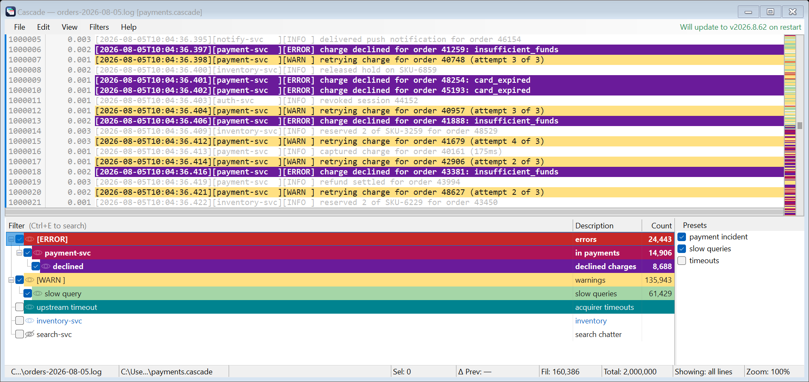
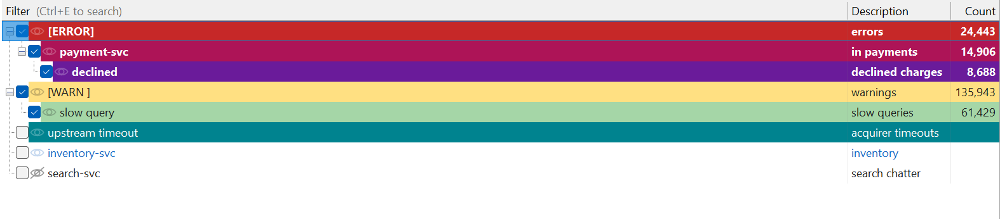
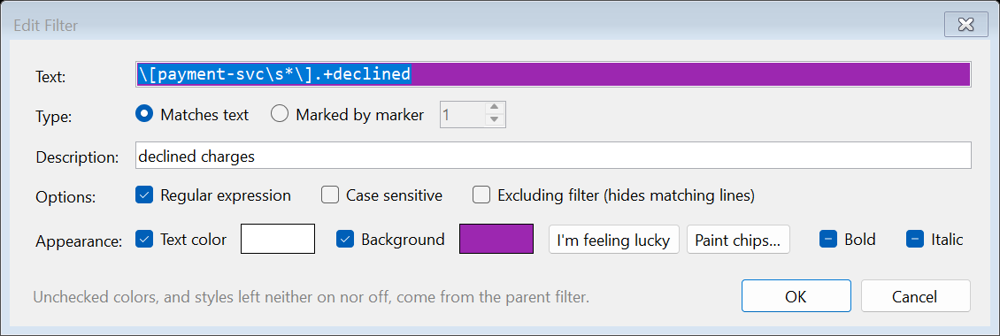
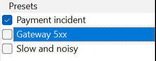
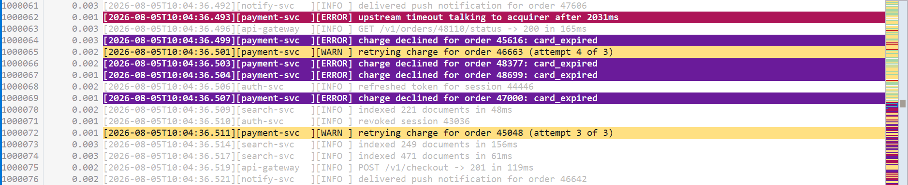
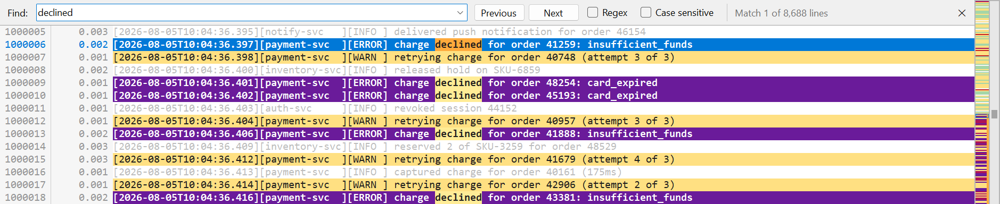
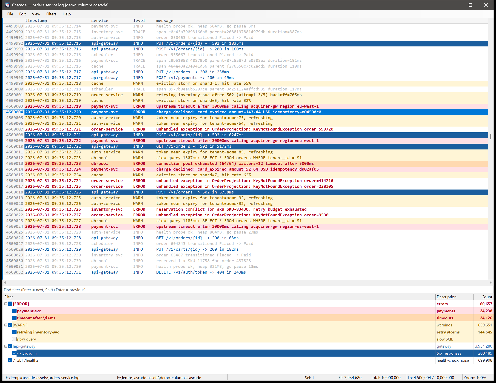

<div align="center">

# Cascade

**A log analyzer for files that don't fit in memory, with filters that nest.**

A from-scratch reimagining of [TextAnalysisTool.NET](https://textanalysistool.github.io/) for Windows.

[](https://github.com/rahul-ramadas/Cascade/actions/workflows/ci.yml)



</div>

Point Cascade at a log, describe what you care about as **filters**, and it colours the lines that
match and dims — or hides — everything else.

|  |  |
|---|---|
| **Opens anything** | Memory-mapped and indexed as it streams, 4 bytes a line. A 1 GB / 10 M-line log is on screen in milliseconds and fully indexed in under half a second. |
| **Filters nest** | A filter refines its parent: `[ERROR]` → `payment-svc` means *errors, in payments only*. |
| **Nothing blocks** | Matches appear while the file is still being scanned, and the line you were reading holds its place on screen while they do. |
| **Instant on repeat** | Results are cached per filter, so switching one on and off again is a few milliseconds however big the file. |
| **Remote-desktop friendly** | WinForms and GDI, no GPU — text travels as drawing orders, not bitmaps. |
| **One file** | A single `.exe`, no installer, and it updates itself. |

---

## Filters



A filter is a substring, a .NET regular expression, or *marked by marker N*, dressed with colours, bold,
italic and underline, a description and an optional case-sensitivity flag. Filters are **includes** (show
these lines) or **excludes** (but not these), and every row carries a **live count** that climbs while
the file is still being scanned.

Nesting is the point: a filter matches a line only if its own pattern **and every ancestor's** match,
whether or not those ancestors are switched on — so *parent off, children on* scopes a whole branch
without flooding the view with it. A line is shown when an enabled include matches it and no enabled
exclude does; its colour comes from the deepest match, and anything left unset is inherited.



Work on one filter or on a whole selection: enable, disable, delete, duplicate, recolour, reorder, nest
and drag a group as one, with undo and redo a hundred steps deep. `Ctrl+E` searches a list of hundreds
without hiding or reordering it, and `F4` walks the matches of one filter without changing what's on
screen.

### Presets



A preset names a combination of filters — *the payment incident*, *the slow queries*. The tick says
which are in effect, the highlight says which one the commands act on, and ticking two gives you both.
Ticking and unticking move only that preset's own filters; anything you switched on by hand stays as
you left it.

### Dim or hide



`Ctrl+H` switches between dimming the lines that didn't match and hiding them altogether. Line numbers
are always the file's own, and the line you were on keeps its place through the switch.

---

## Reading the file



**Find** is a bar above the log rather than a dialog over it, so the search and its results are on screen
at once. Literal or regex, every occurrence in view marked as you type, and a count that fills in as it
sweeps — `Match 12 of 348` — keeping what you can see apart from what the filters are hiding.

**The minimap** stands in for the scrollbar: the log zoomed out to a pixel a line, in the colours the
filters gave it, with empty stretches compressed so that a rare match is still worth a pixel. Drag it to
scroll, click to jump; your markers and search hits ride alongside. `Ctrl+M` brings back a plain
scrollbar.

**Markers** are eight colours you apply by hand — `Ctrl+1`…`Ctrl+8` to set, `1`…`8` to walk them. They
are a filter type too, so lines you picked out yourself can be treated as a category.

**Hover a line** and Cascade names the filters that matched it, including the ones you had switched off
— usually the one you were about to go looking for. Drag inside a line to select part of it; `Ctrl+N`
turns that into a filter, which is the quickest way to chase a request id you just spotted. `Alt+Z`
wraps long lines.

### Fields



`Ctrl+Shift+C` splits each line into **fields** for display — and **View > Split Lines Into Fields** reads
them off the line under the caret for you. A template is a picture of your line: write one out, then
replace the text that changes with `*` and wrap each field in `{ }`.

```
your line:  [2026-08-05T05:00:02][BthPort][INFO] WDF PnP state: started
template:   {[*]}{[*]}{[*]} {*}
```

| | |
|---|---|
| `*` | the text that changes — matches as little as it can, up to whatever you wrote next |
| `{ }` | one **field**: the thing that is hidden or moved, punctuation and all |
| anything else | has to be there, except a run of spaces, which matches any run of spaces |
| `\` | makes `{ } * \` ordinary |

Then pick a **layout**, from the two items under **View > Split Lines Into Fields** or with `Ctrl+Shift+X`,
which switches between them. **Columns** lines the fields up under a header: drag an edge to resize
(snapping to whole characters in a fixed-pitch font), double-click an edge to fit a column to its content,
carry a header sideways to reorder, double-click a name to rename it, right-click for the tick list.
**Inline** keeps every row a line and simply leaves out what you have hidden — better when one field is far
longer than the rest — with a strip of chips above the log instead of a header: click one to put that field
away or bring it back, drag it to move the field along the row, double-click it to rename it.

Hiding a field takes its punctuation with it, so `[a][b][c]` closes up to `[a][c]` rather than leaving
empty brackets behind, and a field carried elsewhere leaves the space that separated it behind as well.
**View > Field Settings…** shows the template against real lines from the file: a coloured band per field,
and beneath it the row as it will actually be drawn — cell by cell in the Columns layout, widths and
alignment included. Both rows are named, so a row whose fields have been moved about still says which
value is which. Click a field in either row to pick its entry out of the list; move a field along the row by
dragging its entry, by the buttons, or with `Alt+↑` / `Alt+↓`, and rename one with `F2`. The dialog also says
how many of the sampled lines match, and, for one that does not, the character where it stopped matching.

Filtering and searching always run on the whole raw line, so this can shorten a line but never hide one.
A line the template does not match is shown whole and untouched, and Cascade says so when a search lands
on a match you cannot see.

---

## Install

Download **[Cascade.exe](../../releases/latest/download/Cascade.exe)** and run it — a single file, no
installer. That link always points at the newest build, so it works from a terminal too:

```powershell
curl.exe -fL --remove-on-error -o Cascade.exe https://github.com/rahul-ramadas/Cascade/releases/latest/download/Cascade.exe
```

It needs Windows and the .NET 10 Desktop Runtime, writes nothing but `%APPDATA%\Cascade`, touches no
registry keys, and updates itself.

## And the rest

- **Opening** — `Ctrl+O`, `F5` to reload, *Open from Clipboard*, recent files, a path on the command line, or drag a file onto the window. Dropping a `.cascade` or `.tat` loads its filters instead.
- **Encodings** — a byte-order mark is honoured, otherwise UTF-8 is assumed. When a file has neither — a code page, or UTF-16 written without a mark — *View ▸ Encoding* reads it again as UTF-8, UTF-16 LE/BE, UTF-32 LE/BE, Windows-1252 or your system code page. A tick shows which is in effect, *Auto-detect* names what it found, and the choice survives a reload.
- **Copying** — selected lines with or without line numbers, or *Save Current Lines* to write out exactly what the filters are showing.
- **Preferences** — font, size, line spacing, colours, tab size, markers, line numbers, which end of the list new filters join; exportable to carry between machines.
- **Keyboard-complete and accessible** — every feature has a shortcut or a menu item, and the log view exposes each row to UI Automation.
- **Survives being killed** — settings, state and filter files are written as you change them, not on the way out.

---

<details>
<summary><b>Keyboard reference</b></summary>

**Log view**

| Key | Action |
|---|---|
| `↑` `↓` `PgUp` `PgDn` | Move the caret (`Shift` extends the selection) |
| `Ctrl+Home` / `Ctrl+End` | First / last line |
| `Ctrl+↑` / `Ctrl+↓` | Scroll a line without moving the caret |
| `←` `→` / `Home` `End` | Scroll sideways / to the far left and right |
| Drag, double-click, triple-click | Select part of a line, a word, the whole line |
| `Ctrl+A` / `Ctrl+C` | Select all / copy |
| `1`…`8` / `Shift+1`…`8` | Next / previous line with that marker |
| `Ctrl+1`…`Ctrl+8` | Toggle that marker on the selection |
| `Ctrl`+wheel | Zoom |

**Filter list**

| Key | Action |
|---|---|
| `Space` / `Shift+Space` | Enable or disable the selection / their subtrees |
| `Enter` / `Delete` / `Ctrl+D` | Edit / remove / duplicate the selection |
| `Shift+↑ ↓` / `Ctrl+↑ ↓` / `Ctrl+Space` / `Ctrl+A` | Extend, move through, add to, or take the whole selection |
| `Alt+↑ ↓ ← →` | Move, nest and un-nest |
| `F4` / `Shift+F4` | Next / previous line matching the current filter |
| `Ctrl+E`, then `Enter` / `Shift+Enter` / `F3` | Search the list and walk the matches |
| Double-click a filter / the empty space below | Edit it / add a new one |

**Global**

| Key | Action |
|---|---|
| `Ctrl+O` / `F5` / `Ctrl+S` | Open / reload / save filters |
| `Ctrl+Z` / `Ctrl+Y` | Undo / redo a filter edit |
| `Ctrl+F` / `F3` / `Shift+F3` | Find / next / previous |
| `Ctrl+G` / `Ctrl+H` | Go to line / show only filtered lines |
| `Ctrl+N` | New filter from the selection or the current line |
| `Ctrl+E` | Search the filter list |
| `Ctrl+M` / `Alt+Z` / `Ctrl+Shift+C` | Minimap or plain scrollbar / word wrap / split lines into fields |
| `Ctrl+Shift+X` | Switch between the Columns and Inline field layouts |
| `Ctrl+Shift+P` / `Ctrl+Shift+L` | Show or hide the presets pane / the filter list |
| `Ctrl+Shift+T` / `Ctrl+Shift+F` | Focus the log view / the filter list |
| `Ctrl+Shift+↑ ↓ ← →` | Dock the filter list |
| `Ctrl++` / `Ctrl+-` / `Ctrl+0` | Zoom in / out / reset |
| `Tab` | Move between the log and the filter list |
| `Esc` | Stop a search, then close the bar and clear its marks |

</details>

## Files and command line

`.cascade` is the native filter set — JSON holding the filter tree with its per-property styles, any
presets, the field template with its layout, and the view mode, so it diffs well in source control. TextAnalysisTool.NET
`.tat` files are **imported** (flattened to top-level filters, keeping patterns, colours and flags);
saving is always `.cascade`. Preferences live in `%APPDATA%\Cascade\settings.json` and machine-local
state in `state.json`; `CASCADE_SETTINGS_DIR` overrides the folder.

```
Cascade.exe [file] [/Filters:<path>]
```

Or, as the first argument: `--help`, `--version`, `--selftest`, `--screens <dir>`.

## Coming from TextAnalysisTool.NET

Everything you rely on is here — the filter list with its checkboxes and counts, includes and excludes,
substring and regex matching, colours per filter, the eight markers, `Ctrl+H`, find, encodings, zoom, a
dockable filter list, recent files and `.tat` import. Deliberately different: **filters nest**, so saving
is `.cascade` (the old format cannot express a hierarchy or per-property style inheritance, but flat
`.tat` sets import unchanged); copy is plain text, optionally with line numbers; and there are no
plug-ins, no live tail, no `A`–`Z` filter cycling and no `/Config:`, `/Line:` or `/Clipboard` — `F4` and
the filter-list search do the cycling job.

## Building

```powershell
dotnet build Cascade.slnx -c Release
dotnet test tests/Cascade.Core.Tests/Cascade.Core.Tests.csproj   # engine tests
./scripts/Run-UiTests.ps1 -Publish                               # UI automation, off-screen
```

.NET 10 SDK. `src/Cascade.Core` is a UI-agnostic engine (mapping, indexing, filtering, find, markers,
columns, persistence, updating) with no reference to WinForms; `src/Cascade.App` is the GUI. Filter files
written by older builds are read and their column settings migrated (`schemaVersion` 1 → 2).

## License

[MIT](LICENSE) © 2026 Rahul Ramadas.
