<div align="center">

# Cascade

**A log analyzer for files that don't fit in memory, with filters that nest.**

A from-scratch reimagining of [TextAnalysisTool.NET](https://textanalysistool.github.io/) for Windows.

[](https://github.com/rahul-ramadas/Cascade/actions/workflows/ci.yml)

[Download](../../releases/latest/download/Cascade.exe) ·
[Filters](#filters) ·
[Reading the log](#reading-the-log) ·
[Fields](#fields) ·
[Files](#files) ·
[Settings](#settings) ·
[Keyboard](#keyboard-reference)


</div>

---

## Filters

### What a filter is


- Matches a **substring**, a **.NET regular expression**, or **marked by marker 1–8**.
- A line is shown when an enabled **include** matches it and no enabled **exclude** does.
- Colour, background, bold, italic and underline are each **on, off, or inherited**.

### Nesting

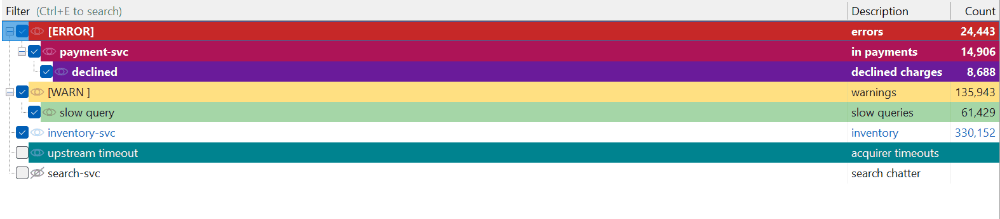

- A child narrows its parent: `[ERROR]` → `payment-svc` means *errors, in payments only*.
- A child matches a line only if **every one of its ancestors matches it too** — whether or not those ancestors are switched on.
- So switching a parent off does not stop it narrowing its children: you can scope a branch without showing everything the parent matches.
- A line takes its colour from the **first filter in the list** that matched it, refined by whichever of that filter's own descendants matched too — never by a filter in a branch further down, however deeply nested.
- Whatever the winning filter leaves unset it inherits from the filters above it, so a filter with no colour of its own draws the line in the view's default colours.
- Nest with `Alt+→`, or by dragging.

### The filter list


- **Count** is how many lines in the whole file match, not how many are on screen.
- `Shift+Space` switches a filter's whole subtree on or off.
- The list docks to any edge of the window, or hides altogether (`Ctrl+Shift+L`).

### From the log to a filter

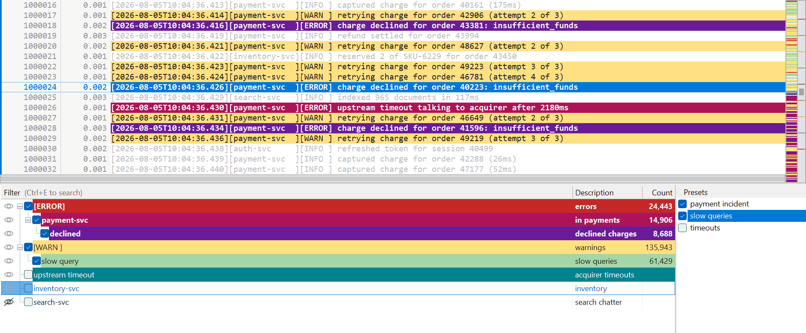

- `Ctrl+N` turns the text you have selected inside a line — or the whole line under the caret — into a filter.

### Where a new filter goes

- Every new filter is made in the same dialog, which asks where it should go:

| Key | Where it goes |
|---|---|
| `Ctrl+N` | The top of the list, or the end of it — your preference |
| `Ctrl+Shift+N` | Directly above the selected filter, as its sibling |
| `Ctrl+Alt+N` | Under the selected filter, as its child |

- The key you press only picks a starting point. All three are offered in the dialog, each with its key beside it, and pressing another one there moves the choice — so changing your mind after `Ctrl+N` costs a keystroke and never the mouse.
- The pattern box previews the colours the filter would really take where it is going, inheritance and all, so the preview follows the choice.
- A place that cannot be had — nothing selected to sit above, or nesting that would run past the deepest level — is shown but greyed, and asking for it settles on the default.

### Colour

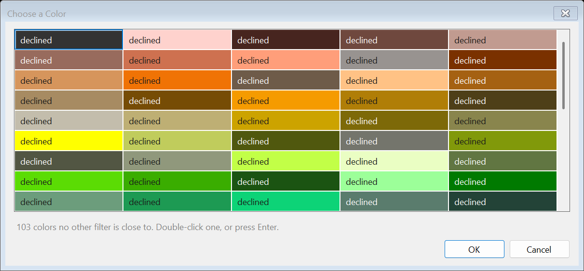

- **I'm feeling lucky** picks a legible colour pair that no other filter is using; **Paint chips…** shows the rest of the palette.
- A filter with no colour of its own leaves no mark on the match map.

### Working on many at once

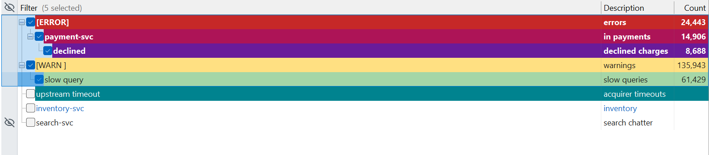

- Select several filters and enable, disable, delete, duplicate, reorder, nest or recolour them in one go.
- Dragging carries the whole selection, nesting and all.
- `Ctrl+Z` undoes filter edits, drags included.

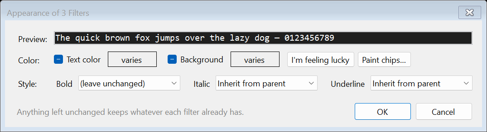

### Finding a filter among hundreds

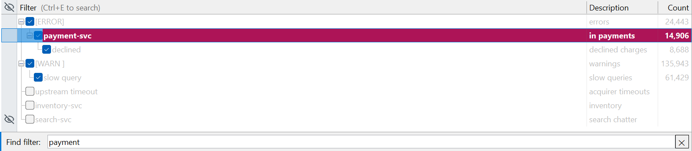

- `Ctrl+E` searches the list **without hiding or reordering it** — non-matching filters dim rather than disappear.
- `F4` / `Shift+F4` walk the log through the selected filter's matches, without changing which filters are on.

### Presets


- A preset names a combination of filters — *the payment incident*, *the slow queries*.
- The **tick** applies a preset; the **highlight** only says which one the commands act on.
- Ticking two gives you both, and ticking one moves only its own filters — anything you switched on by hand stays as you left it.

### Dim or hide


- `Ctrl+H` switches between dimming the lines that didn't match and hiding them altogether.
- Line numbers are always the file's own, either way.

---

## Reading the log

### Find


- `Ctrl+F` searches the text, literal or regex, marking every occurrence on screen as you type.
- Find works on every line, not just the shown ones: hits on hidden lines are counted separately, and it says so when a match lands on one.

### Elapsed times

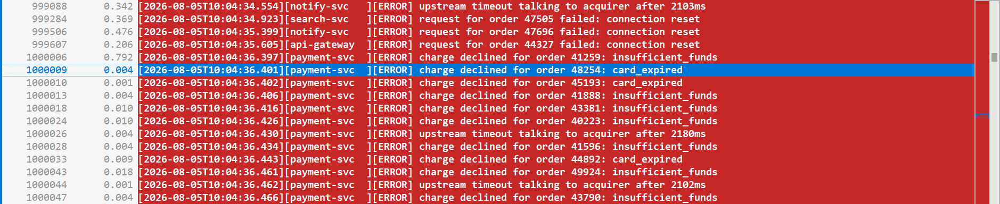

- Cascade finds the timestamp in your log by itself, and puts the time since the previous line in the margin.
- The previous line **on screen** — so with the noise filtered away it measures between the lines you kept, which is a latency profile of whatever the filters select.
- `Ctrl+R` on a line measures everything from **that** line instead: how long after the trigger each thing happened, with the lines above it reading as negative. Unlike the gap to the previous line, it does not change when you filter.

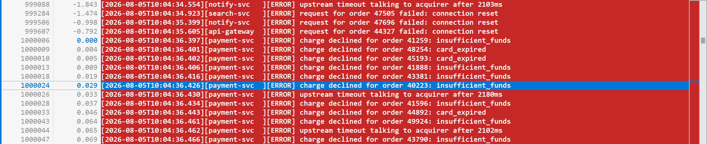

- `Ctrl+Shift+R` steps between the three: the previous line, the start of the file, and your reference. The status bar says which — `Δ Prev`, `Δ Start`, `Δ Ref` — and the column stays the same width whichever it is.
- `Ctrl+Shift+G` goes back to the reference, wherever you have scrolled to since.
- Select a line and the status bar says the same thing in words; select several and it says how long they cover.
- If your timestamp is somewhere the guess cannot reach, name the field it is in under **Field Settings**; **Ctrl+Shift+M** and **Ctrl+Shift+B** turn the two displays off.

### The match map

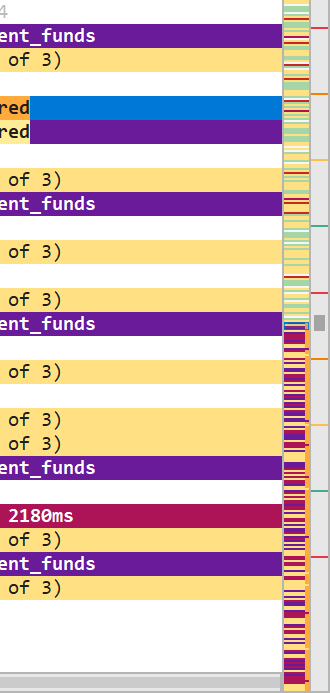

- The scrollbar is replaced by the whole file at a pixel a line, in the colours the filters gave it.
- Unmatched stretches are compressed, so one error among ten thousand ordinary lines still gets a pixel of its own.

### Markers

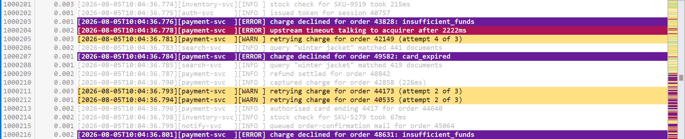

- Eight colours for marking lines by hand: `Ctrl+1`…`Ctrl+8` on the selection.
- The bare number keys `1`…`8` then walk between the lines you marked, `Shift` to go backwards.
- **Marked by marker N** is a filter type, so lines you picked out by hand can be treated as a category.

### What matched this line

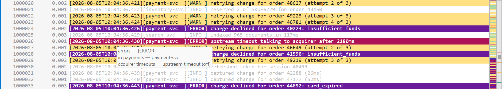

- Hovering a line names every filter that matched it — **including the ones that are switched off**.

### Getting lines out

- **File ▸ Save Current Lines…** writes out exactly what the filters are showing.
- **Edit ▸ Copy with Line Numbers** copies the file's own line numbers along with the text.

---

## Fields

Long lines are either wrapped (`Alt+Z`) or split into fields you can hide and reorder.

### Splitting a line

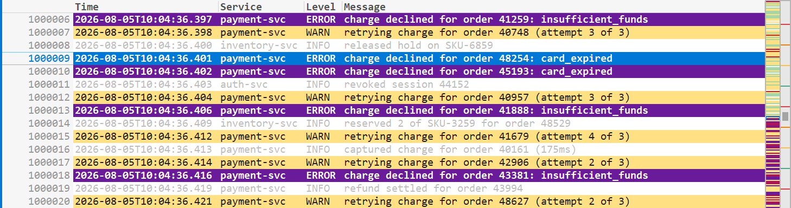

- `Ctrl+Shift+C` splits every line into fields for display, guessing a template from the line under the caret.
- Filtering and searching always run on the whole raw line, so this can shorten a line but never hide one.
- A line the template does not match is left whole and untouched.

### The template

A template is a picture of your line: write one out, replace what changes with `*`, and wrap each field in `{ }`.

```
your line:  [2026-08-05T05:00:02][BthPort][INFO] WDF PnP state: started
template:   {[*]}{[*]}{[*]} {*}
```

| | |
|---|---|
| `*` | the text that changes — matches as little as it can, up to whatever you wrote next |
| `.` | any one character, whatever it happens to be |
| `{ }` | one **field**: the unit that gets hidden or moved, punctuation and all |
| anything else | has to be there, except a run of spaces, which matches any run of spaces |
| `\` | makes `{ } * . \` ordinary |

- Punctuation goes with the field, so hiding the middle of `[a][b][c]` leaves `[a][c]` rather than `[a][][c]`.

### Columns and Inline

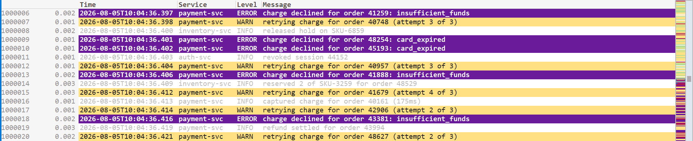

- **Columns** lays the fields out as a table: drag a header to reorder, double-click it to rename, right-click for the list of which fields are shown.

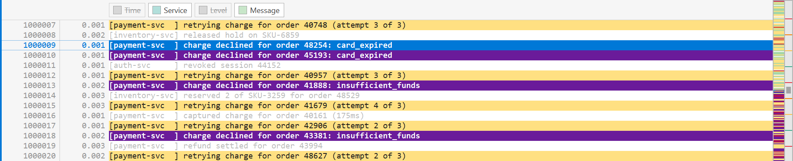

- **Inline** keeps every row a line and leaves out what you hid — better when one field dwarfs the rest.
- A strip of chips stands in for the header: click one to put a field away or bring it back, drag it to move the field along the row.

### Field settings

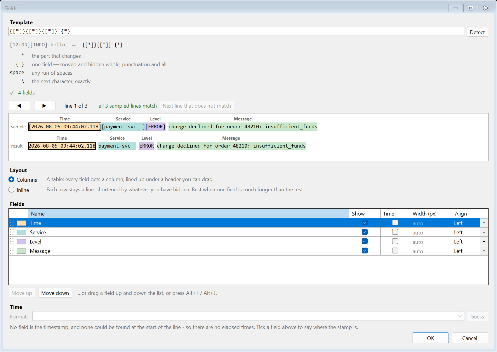

- `Ctrl+Shift+D` tries the template against real lines from the file: how many of them match, and where a line that doesn't stopped matching.
- **Detect** writes the template for you when the line begins with bracketed groups: `[ ]`, `( )` or `< >`.
- Name a field as the **time** and Cascade proposes the format that reads it — a .NET format string like `yyyy-MM-dd HH:mm:ss.fff`, or `epoch:ms` — and shows it reading your own log back to you.

---

## Files

### Opening

- Drop a log on the window, hand it to `Cascade.exe` on the command line, or use **Open from Clipboard** for one you have pasted from somewhere else.
- `F5` re-reads the file, for when you have just re-run whatever produced it.
- Dropping a `.cascade` or `.tat` file loads its filters instead of opening it as a log.
- The file is memory-mapped and indexed as it streams, four bytes a line: a 1 GB, 10-million-line log is on screen in milliseconds and fully indexed in under half a second.

### Encodings

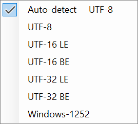

- A byte-order mark is honoured; without one, UTF-8 is assumed.
- **View ▸ Encoding** reads the file again as UTF-16 or UTF-32 (either endianness), Windows-1252 or the system code page.

### Filter files

- `.cascade` is JSON — the filter tree with its styles, the presets, and the field template — so a filter set diffs well in source control.
- `Ctrl+S` saves the set you have; **File ▸ Append Filters…** merges another set into it.
- TextAnalysisTool.NET `.tat` files are imported, flattened to top-level filters. Saving is always `.cascade`.

---

## Settings

### Preferences

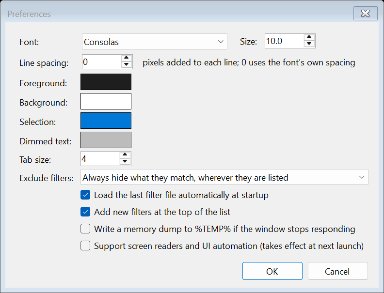

- **File ▸ Settings ▸ Export / Import** moves your preferences to another machine.

### Where things live

- Preferences in `%APPDATA%\Cascade\settings.json`, machine-local state in `state.json`, and nothing at all in the registry. `CASCADE_SETTINGS_DIR` moves the folder.

### Command line

```
Cascade.exe [file] [/Filters:<path>]
```

- `/Filters:` also stops the last-used filter file being loaded automatically.
- `CASCADE_UPDATE=off` turns off the update check.

---

## Install

Download **[Cascade.exe](../../releases/latest/download/Cascade.exe)** and run it — a single file, no installer.

```powershell
curl.exe -fL --remove-on-error -o Cascade.exe https://github.com/rahul-ramadas/Cascade/releases/latest/download/Cascade.exe
```

- Needs Windows and the .NET 10 Desktop Runtime. It updates itself.
- Draws with GDI rather than a GPU, so it stays quick over a remote desktop.

---

## Keyboard reference

**Log view**

| Key | Action |
|---|---|
| `↑` `↓` `PgUp` `PgDn` | Move the caret (`Shift` extends the selection) |
| `Ctrl+Home` / `Ctrl+End` | First / last line |
| `Ctrl+↑` / `Ctrl+↓` | Scroll a line without moving the caret |
| `←` `→` / `Home` `End` | Scroll sideways / to the far left and right |
| Drag, double-click, triple-click | Select part of a line, a word, the whole line |
| `Ctrl+A` / `Ctrl+C` | Select all / copy |
| `1`…`8` / `Shift+1`…`8` | Next / previous line with that marker |
| `Ctrl+1`…`Ctrl+8` | Toggle that marker on the selection |
| `Ctrl`+wheel | Zoom |

**Filter list**

| Key | Action |
|---|---|
| `Space` / `Shift+Space` | Enable or disable the selection / their subtrees |
| `Enter` / `Delete` / `Ctrl+D` | Edit / remove / duplicate the selection |
| `Shift+↑ ↓` / `Ctrl+↑ ↓` / `Ctrl+Space` / `Ctrl+A` | Extend, move through, add to, or take the whole selection |
| `Alt+↑ ↓ ← →` | Move, nest and un-nest |
| `F4` / `Shift+F4` | Next / previous line matching the current filter |
| `Ctrl+E`, then `Enter` / `Shift+Enter` / `F3` | Search the list and walk the matches |
| Double-click a filter / the empty space below | Edit it / add a new one |

**Global**

| Key | Action |
|---|---|
| `Ctrl+O` / `F5` / `Ctrl+S` | Open / reload / save filters |
| `Ctrl+Z` / `Ctrl+Y` | Undo / redo a filter edit |
| `Ctrl+F` / `F3` / `Shift+F3` | Find / next / previous |
| `Ctrl+G` / `Ctrl+Shift+G` | Go to a line you name / to the line you are measuring from |
| `Ctrl+H` | Show only filtered lines |
| `Ctrl+N` / `Ctrl+Shift+N` / `Ctrl+Alt+N` | New filter from the selection or the current line, going to the usual end of the list / above the selected filter / under it as a child |
| `Ctrl+E` | Search the filter list |
| `Ctrl+M` / `Alt+Z` / `Ctrl+Shift+C` | Match map or plain scrollbar / word wrap / split lines into fields |
| `Ctrl+Shift+X` / `Ctrl+Shift+D` | Switch field layout / field settings |
| `Ctrl+Shift+M` / `Ctrl+Shift+B` | Elapsed times in the margin / in the status bar |
| `Ctrl+R` / `Ctrl+Shift+R` | Measure from this line / step through what to measure from |
| `Ctrl+Shift+P` / `Ctrl+Shift+L` | Show or hide the presets pane / the filter list |
| `Ctrl+Shift+T` / `Ctrl+Shift+F` | Focus the log view / the filter list |
| `Ctrl+Shift+↑ ↓ ← →` | Dock the filter list |
| `Ctrl++` / `Ctrl+-` / `Ctrl+0` | Zoom in / out / reset |
| `Tab` | Move between the log and the filter list |
| `Esc` | Stop a search, then close the bar and clear its marks |

---

## Building

```powershell
dotnet build Cascade.slnx -c Release
dotnet test tests/Cascade.Core.Tests/Cascade.Core.Tests.csproj   # engine tests
./scripts/Run-UiTests.ps1 -Publish                               # UI automation, off-screen
./scripts/Build-DocImages.ps1                                    # every picture above, from the app
```

- .NET 10 SDK. `src/Cascade.Core` is the UI-agnostic engine — indexing, filtering, find, markers, columns, persistence — and `src/Cascade.App` is the WinForms GUI.

## License

[MIT](LICENSE) © 2026 Rahul Ramadas.
