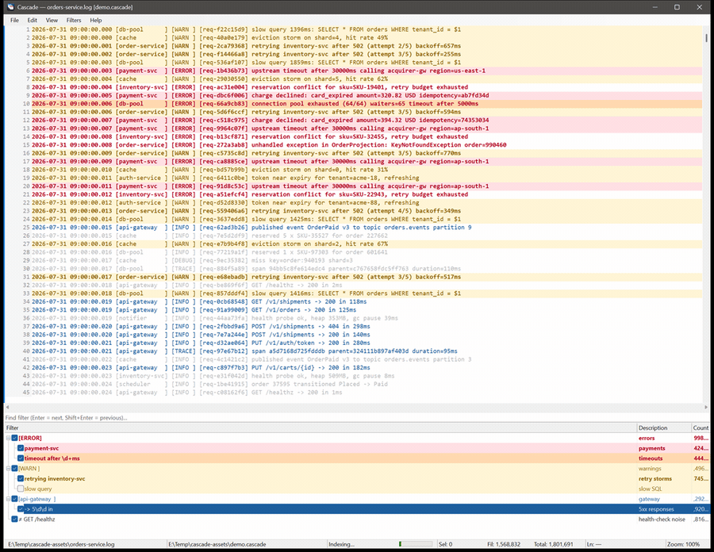
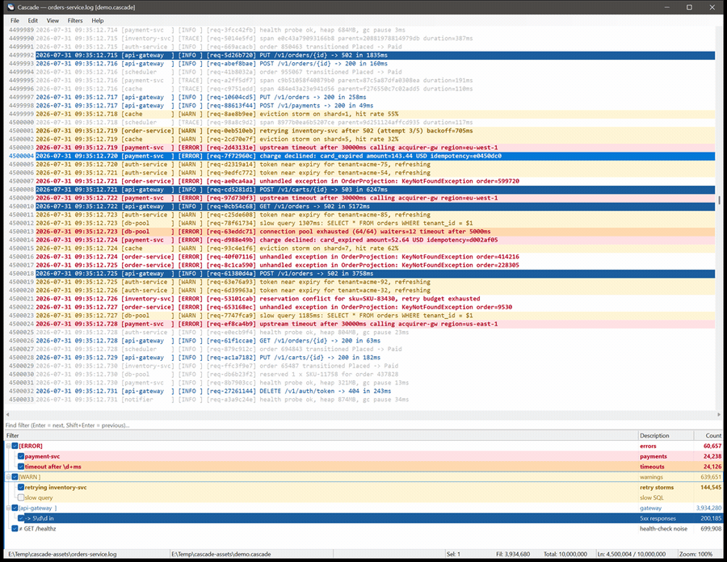
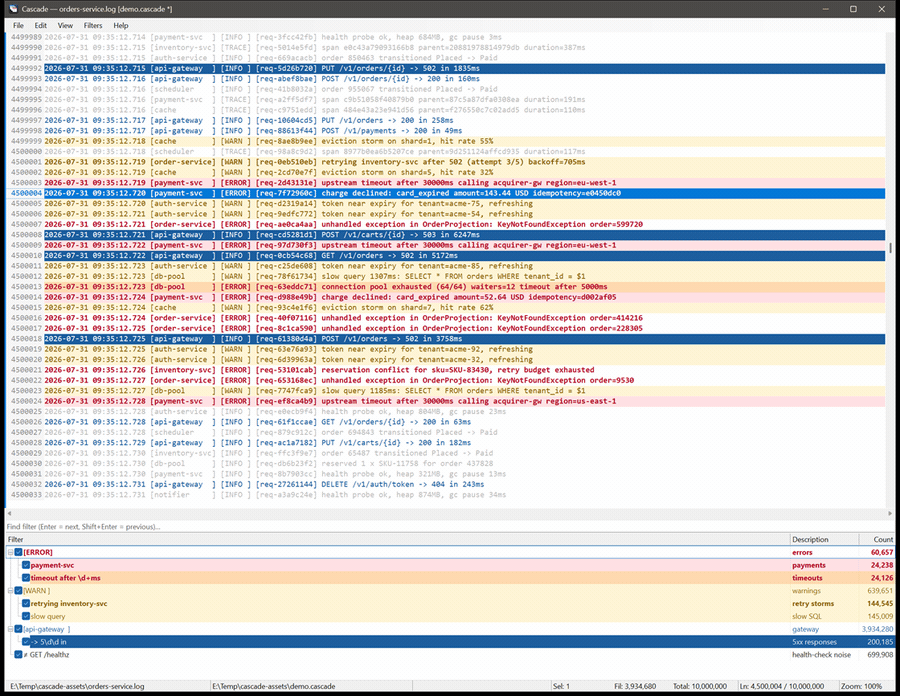
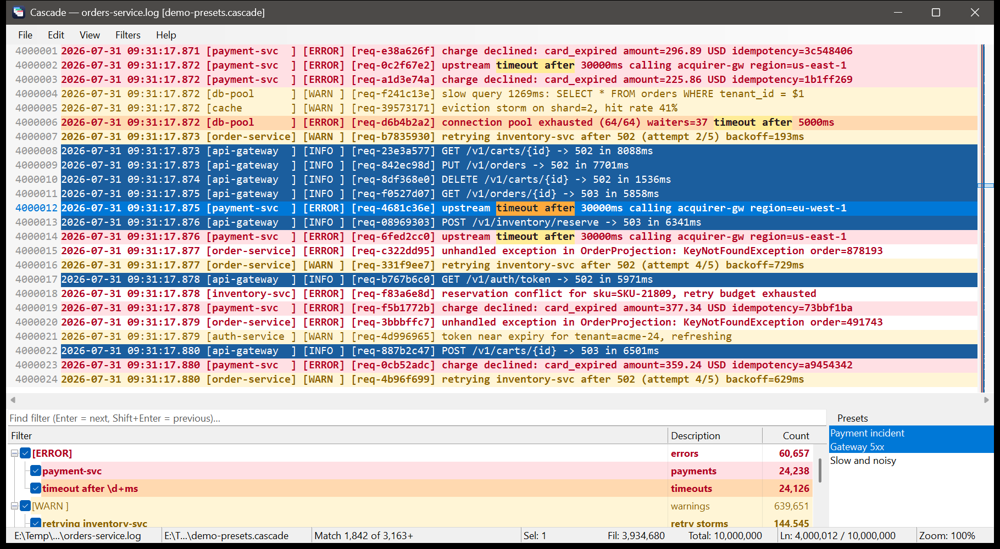

<div align="center">

# Cascade

**A fast log and text analyzer for very large files, with hierarchical filters.**

An enhanced, from-scratch reimagining of [TextAnalysisTool.NET](https://textanalysistool.github.io/)
for Windows — same idea, same muscle memory, built for files that no longer fit in memory.

[](https://github.com/rahul-ramadas/Cascade/actions/workflows/ci.yml)


</div>

---

## What it is

You point Cascade at a log, describe what you care about as a set of **filters**, and it colours the
lines that match and dims (or hides) the ones that don't. That is TextAnalysisTool.NET's idea, and
Cascade keeps it — along with markers, find, encodings, saved filter sets and `.tat` import.

What's different:

| | |
|---|---|
| **Opens anything** | Memory-mapped I/O and a streaming line index. A 1 GB / 10 M-line log is on screen before you can let go of the mouse, and fully indexed in **under half a second**. Nothing is loaded into RAM up front, so file size is not bounded by memory. |
| **Filtering streams** | Matching lines appear while the rest of the file is still being scanned — and the view **stays where you put it** while that happens. |
| **Filters nest** | The headline feature. A filter can refine its parent, so `[ERROR]` → `payment-svc` means *errors, and only in payments*, with its own colour. |
| **Filter list is searchable** | Type to jump between filters in a list of hundreds. It never hides or reorders the list. |
| **Presets** | Name a combination of filters and switch the whole set on with one click. |
| **It explains itself** | Hover a line and Cascade names the filters that matched it — including the ones you have switched off. |
| **Columns** | Split each line into named columns for display, hide the ones you don't want. Filtering still runs on the whole raw line. |
| **RDP-friendly** | WinForms + GDI, no GPU. Text and rectangles travel over Remote Desktop as compact drawing orders instead of bitmaps. |

---

## Install

Grab `Cascade-<version>-win-x64.exe` from the [latest release](../../releases/latest). It is a
**single file** — no installer, no install folder. Copy it anywhere and run it.

Requires **Windows** and the **.NET 10 Desktop Runtime**. The only thing Cascade writes is
`%APPDATA%\Cascade\settings.json` and `state.json` (and a crash log in `%TEMP%` if it ever needs one).
No registry keys.

It also **updates itself**: at startup it checks GitHub on a background thread, downloads quietly,
and tells you in the menu bar. The swap happens on the next launch, atomically, and the old image
deletes itself.

---

## Opening a large file



The window is up and scrollable before indexing finishes; the line count and the per-filter counts
climb as the scan progresses, and filtering starts immediately behind it. Measured on a 1 GB,
10,000,000-line log with the 9 filters shown above (warm file cache):

| | |
|---|---|
| First lines available to the view | **2–4 ms** |
| Fully indexed (10 M lines) | **364–441 ms** |
| First full filter pass finished | **381–810 ms** |
| Toggling a filter afterwards | **6–14 ms** (served from a 5.3 MB match cache) |

Only the rows on screen are ever decoded, and the index costs 8 bytes per line.

---

## Filters

A filter is a **substring**, a **.NET regular expression**, or **"marked by marker N"**, plus a
case-sensitivity flag, an optional description, and any of foreground colour, background colour,
bold and italic.


Filters are either **includes** (show these lines) or **excludes** (and not these). Anything you
leave unset is inherited from the parent filter, per property — so a child can add a background
colour and keep its parent's red bold text.

### Hierarchy


Nesting is what makes a large filter set manageable. The rules are small enough to keep in your head:

- A filter matches a line only if **its own pattern and every ancestor's pattern** match — whether or
  not those ancestors are enabled. `[ERROR]` → `payment-svc` therefore means *payment-svc lines that
  are also errors*, not *payment-svc lines*.
- A line is **shown** when some enabled include matches it and no enabled exclude does.
- Its colour comes from the **deepest** enabled include that matches (ties go to the topmost),
  with each unset property inherited from the nearest ancestor that sets it.
- Because a parent's pattern constrains its children whether or not the parent is enabled,
  *parent off, children on* is a useful arrangement — scope to `[ERROR]`, then surface only the
  categories you're interested in.
- An exclude removes lines rather than scoping them, so it belongs at the end of a chain rather than
  having children of its own. Nesting goes up to 8 levels deep.

Each row shows the pattern, its description, and a **live count** of matching lines that updates
while the file is being scanned.

### Dim or hide


`Ctrl+H` switches between dimming non-matching lines and hiding them entirely. Original line numbers
are always shown — so a filtered view still tells you where you are in the file — and the line you
were on holds its place on screen through the switch.

### Working the list



Ticking a filter or disabling a whole subtree with `Shift+Space` re-evaluates the file, and again the
line you were looking at **stays exactly where it was on screen**, even while several million rows
are being added or removed above it.



`Ctrl+E` focuses the search box. Typing dims the filters that don't match and jumps to the ones that
do (`Enter` / `Shift+Enter` to walk them); it never hides or reorders the list, so the filter you
were looking at doesn't move.

You can also:

- **Work on several filters at once.** `Ctrl`-click to add one, `Shift`-click or `Shift+↑ ↓` to take a
  run of them, `Ctrl+A` for all of them. Enabling, disabling, deleting, duplicating, moving and setting
  colours then apply to the whole group — one re-evaluation, and one step to undo. The strip left of each
  filter's text is shaded to show it is in the group, and shaded harder on the row the keyboard is
  standing on; the header says how many are selected, so a group scrolled out of sight cannot surprise you.
- **Set one appearance across a group.** Colours and styles they already share are offered back;
  anything they disagree on says *varies* and is left alone unless you change it.
- **Undo and redo** filter edits with `Ctrl+Z` / `Ctrl+Y` — adding, editing, removing, duplicating,
  reordering, nesting and appending a file, a hundred steps deep. The menu names what it will take back
  ("Undo Remove 3 Filters"). Ticking a filter is not an edit and is not undone.
- **Duplicate a filter and its subtree** with `Ctrl+D`.
- **Reorder and nest** with `Alt+↑ ↓ ← →`, or by dragging — the filter and its subtree move live to
  where they would land, so you can see the result before you drop. A group is carried as one row.
- **Jump to matches of one filter** with `F4` / `Shift+F4`, without changing what's shown.
- **Create a filter from the current line** with `Ctrl+N`, prefilled with the line's text — or with just
  the part of the line you selected.
- **Dock the list** to any edge with `Ctrl+Shift+↑ ↓ ← →`, or hide it with `Ctrl+Shift+L`.

### Presets

A filter set that answers several different questions ends up with a lot of ticking and unticking. A
**preset** names a combination — *the payment incident*, *the slow queries*, *everything about auth* —
and puts it on in one click.

Selecting a preset enables exactly its filters and turns the rest off; `Ctrl`+click adds a preset to what
is already on, or takes it back out. Nothing about "which preset is active" is stored: a preset shows as
in effect whenever every filter it names is enabled, so building the same combination by hand lights it
up too. Presets live in the `.cascade` file with the filters, and a preset that names a filter you have
since deleted says so rather than quietly dropping it.

`Ctrl+Shift+P` shows or hides the pane; the commands are under **Filters ▸ Presets**.

---

## Reading the file

### The match map

The log view has no vertical scrollbar. In its place is a **map of the whole file**: every filter's
matches drawn in its own colour, your markers, the lines a search found, and a rectangle showing where
you are. Dense bands are where the interesting lines cluster; the map is the scrollbar, so drag the
rectangle to scroll and click anywhere to jump there. `Ctrl+M` puts the ordinary scrollbar back.

### Selecting part of a line

Drag within a line to select just that text; double-click takes a word (identifiers, paths and request
ids come along whole), triple-click takes the line. `Ctrl+C` copies exactly the selection, and `Ctrl+N`
makes a filter out of it — which is the quickest way to turn a request id you just spotted into a filter.
Dragging onto another line means whole lines again, as it always did.

### Word wrap

`Alt+Z` folds long lines into the width of the window instead of running them off the side. Line numbers
still count lines, not screen rows, so a wrapped view says the same thing about where you are as an
unwrapped one. (Not available while columns are on, which lay text out in fixed cells.)

### What matched this line

Hover a line for half a second and Cascade lists the filters that matched it: the pattern in full, `≠`
for the excludes that take lines away, and `(off)` for a filter that matched but is switched off — which
is usually the one you were about to go looking for. Turn it off under **View**.

---

## Find


Literal or regular-expression search, forwards or backwards, with progress and a cancel button for
the times you search a 1 GB file for something that isn't there.

**Every occurrence is marked**, on every line you can see, the moment you start typing — the line you
are on gets a stronger tint, and a selection you have made gets a third. Typing only marks what is
already on screen: it never scrolls, never searches, and costs nothing on a huge file. `Enter` starts
the real search and the background sweep that produces the counts.



**It tells you where you are**: `Match 12 of 348`. In filtered mode it separates what you can see from
what the filters are hiding, and counts extra occurrences on lines that matched more than once —
`Match 12 of 252 lines · 96 hidden · 891 of 1,204 hits`. Every number carries a `+` while the sweep is
still running, so a partial count never reads as a final one.

The sweep runs in parallel across cores, spreading outwards from the caret so the first result and the
first *backward* result both arrive quickly. Measured on the 1 GB, 10,000,000-line log: a full sweep for
a term that is absent went from **230–250 ms to 31–42 ms**, with first-result latency unchanged.
Everything already examined is remembered, so `F3` after that is instant.

The marks stay after you close the dialog — they are the point of the search, not part of the window.
`Esc` walks back out one step at a time: close the dialog, stop a running sweep, then clear the term and
its marks. The box remembers your last twenty searches.

In filtered mode, find only ever lands on a line you can actually see.

When a search runs out of matches — plain find, per-filter find, the filter-list search, or marker
navigation — the whole window flashes briefly and the status bar says why.

---

## Markers

Eight markers, `Ctrl+1`…`Ctrl+8` to toggle one on the selected lines, `1`…`8` and `Shift+1`…`Shift+8`
to walk them, drawn as coloured bars in the left gutter. Markers are also a filter type, so you can
hand-pick lines and then treat them as a category — colour them, exclude them, or nest something
under them. The gutter can be shown always, never, or only when markers are in use.

---

## Columns


Split each line for display, either on a **single delimiter** (optionally collapsing runs of it, with
an optional split limit) or with a **bracket template** naming each field:

```
[timestamp] [[service]] [[level]] [[request]] [message]
```

Each `[name]` is a column; everything else — including the literal brackets written as `[[name]]` —
is separator. Columns can be renamed, resized, aligned and hidden (`request` is hidden above), and
splitting is lazy, so it costs nothing on a huge file. **Filtering always runs on the whole raw
line**, so turning columns on can't change what you see.

---

## Everything else

- **Opening files** — `Ctrl+O`, `F5` to reload, *Open from Clipboard*, a recent-files list, or a path
  on the command line.
- **Encodings** — auto-detect (BOM first), UTF-8, UTF-16 LE/BE, Windows-1252, or the system default;
  reopen with a different one at any time.
- **Copy** — selected lines, with or without line numbers. Selection is multi-line with `Shift` and
  `Ctrl`.
- **Save Current Lines** — writes exactly what the filters are showing to a new file.
- **Filter sets** — save, load and append `.cascade` files; the last one you used is reloaded at
  startup (switch that off in preferences). The title bar and status bar always name the filter file
  in use and mark it dirty when it has unsaved changes.
- **Preferences** — font and size, text/background/selection/dimmed colours, tab size, line numbers,
  marker visibility, filter auto-load. Export and import them as a file to move them between
  machines; recent files and other machine-local state are deliberately left out.
- **Status bar** — file path, filter-file path, what it's busy with and how far along, then selected /
  filtered / total line counts, the caret line, and the zoom level. The fields have fixed widths, so
  nothing jitters while the numbers change.
- **Zoom** — `Ctrl++`, `Ctrl+-`, `Ctrl+0`, or `Ctrl`+wheel.
- **Keyboard-complete** — every feature has a shortcut or a menu item, `Tab` cycles the three panes,
  and the focused pane is marked with an accent bar.
- **Accessible** — the log view exposes each visible row to UI Automation with its line number and
  selection state, which is also how the automated UI tests drive the app.
- **Survives being killed** — settings, state and filter files are written atomically as you change
  them, not on the way out, so ending the process from Task Manager loses nothing.

---

## Keyboard reference

<details>
<summary><b>Log view</b></summary>

| Key | Action |
|---|---|
| `↑` `↓` `PgUp` `PgDn` | Move the caret (`Shift` extends the selection) |
| `Ctrl+Home` / `Ctrl+End` | First / last line |
| `Ctrl+↑` / `Ctrl+↓` | Scroll a line without moving the caret |
| `←` `→` | Scroll sideways four characters |
| `Home` / `End` | Scroll to the far left / far right |
| Drag | Select part of a line |
| Double- / triple-click | Select a word / the whole line |
| `Ctrl+A` | Select all |
| `Ctrl+C` | Copy (the selected text, or the selected lines) |
| `1`…`8` / `Shift+1`…`8` | Next / previous line with that marker |
| `Ctrl+1`…`Ctrl+8` | Toggle that marker on the selection |
| `Ctrl`+wheel | Zoom |

</details>

<details>
<summary><b>Filter list</b></summary>

| Key | Action |
|---|---|
| `Space` | Enable / disable the selected filters |
| `Shift+Space` | Enable / disable them and everything under them |
| `Enter` | Edit the selection — appearance only when there is more than one |
| `Delete` | Remove them |
| `Ctrl+D` | Duplicate them and their subtrees |
| `Shift+↑` / `Shift+↓` | Extend the selection |
| `Ctrl+↑` / `Ctrl+↓` | Move between filters without changing the selection |
| `Ctrl+Space` | Add / remove the filter you are standing on |
| `Ctrl+A` | Select every filter |
| `Alt+↑` / `Alt+↓` | Move them up / down |
| `Alt+→` / `Alt+←` | Nest them under the filter above / un-nest them |
| `F4` / `Shift+F4` | Next / previous line matching the current filter |
| `Ctrl+F` | Focus the search box |
| `F3` / `Shift+F3` | Next / previous filter matching the search box |
| `Esc` | Clear the search box |

</details>

<details>
<summary><b>Global</b></summary>

| Key | Action |
|---|---|
| `Ctrl+O` / `F5` | Open / reload |
| `Ctrl+S` | Save filters |
| `Ctrl+Z` / `Ctrl+Y` | Undo / redo a filter edit |
| `Ctrl+F` / `F3` / `Shift+F3` | Find / next / previous |
| `Ctrl+G` | Go to line |
| `Ctrl+H` | Show only filtered lines |
| `Ctrl+N` | New filter from the selection or the current line |
| `Ctrl+E` | Focus the filter search box |
| `Ctrl+M` | Match map or ordinary scrollbar |
| `Alt+Z` | Word wrap |
| `Ctrl+Shift+P` | Show or hide the presets pane |
| `Ctrl+Shift+T` / `Ctrl+Shift+F` | Focus the log view / the filter list |
| `Ctrl+Shift+L` | Show or hide the filter list |
| `Ctrl+Shift+↑ ↓ ← →` | Dock the filter list |
| `Ctrl++` / `Ctrl+-` / `Ctrl+0` | Zoom in / out / reset |
| `Tab` / `Shift+Tab` | Cycle focus between the panes |
| `Esc` | Close the find dialog, then stop a running search, then clear the marks |

</details>

---

## Files

- **`.cascade`** — the native filter set: indented JSON holding the whole filter tree with its
  per-property styles, any presets, the column spec, and whether filtered mode is on. Versioned and
  additive, so it is diffable and safe to keep in source control.
- **`.tat`** — TextAnalysisTool.NET filter files are **imported** (flattened to top-level filters,
  keeping text, regex and case flags, colours, enabled and excluding state, descriptions and
  markers). Saving is always `.cascade`.
- **Settings** — `%APPDATA%\Cascade\settings.json` (portable preferences; this is what
  Export/Import moves) and `state.json` (recent files and other machine-local state, never exported).
  `CASCADE_SETTINGS_DIR` overrides the folder.

## Command line

```
Cascade.exe [file] [/Filters:<path>] [/demo]
```

`/Filters:` takes a `.cascade` or `.tat` file and suppresses the automatic reload of the last one.
Only the last file and the last `/Filters:` are used.

As the **first** argument: `--help`, `--version`, `--selftest` (headless engine, settings and
rendering checks), `--screens <dir>` (render every dialog and the main window to PNGs).
`CASCADE_UPDATE=off` disables the update check.

---

## Coming from TextAnalysisTool.NET

Everything you rely on is here: the filter list with checkboxes and live counts, include/exclude
filters, substring and regex matching, colours per filter, the 8 markers, `Ctrl+H`, find,
encodings, zoom, dockable filter list, recent files, and `.tat` import.

A few things are deliberately different:

- **Filters nest.** Flat `.tat` sets import unchanged, so this only costs you something when you
  want it.
- **Saving is `.cascade`, not `.tat`** — the old format cannot express a hierarchy or per-property
  style inheritance.
- **No plug-ins.** Files are read as text.
- **Copy is plain text** (optionally with line numbers); there is no HTML/colour clipboard format.
- **No `A`–`Z` filter cycling or `Space` for the next matching line.** The equivalents are `F4` /
  `Shift+F4` on the selected filter, and the filter-list search for reaching a filter quickly.
- **No live tail**, and `/Config:`, `/Line:` and `/Clipboard` are not implemented.

---

## Building

```powershell
dotnet build Cascade.slnx -c Release
dotnet test tests/Cascade.Core.Tests/Cascade.Core.Tests.csproj   # engine tests
./scripts/Run-UiTests.ps1 -Publish                               # UI automation, off-screen
```

.NET 10 SDK. `src/Cascade.Core` is a UI-agnostic engine (mapping, indexing, filtering, find, markers,
columns, persistence, updating) with no reference to WinForms; `src/Cascade.App` is the GUI. Design
notes and the reasoning behind the engine live in [docs/DESIGN.md](docs/DESIGN.md).
