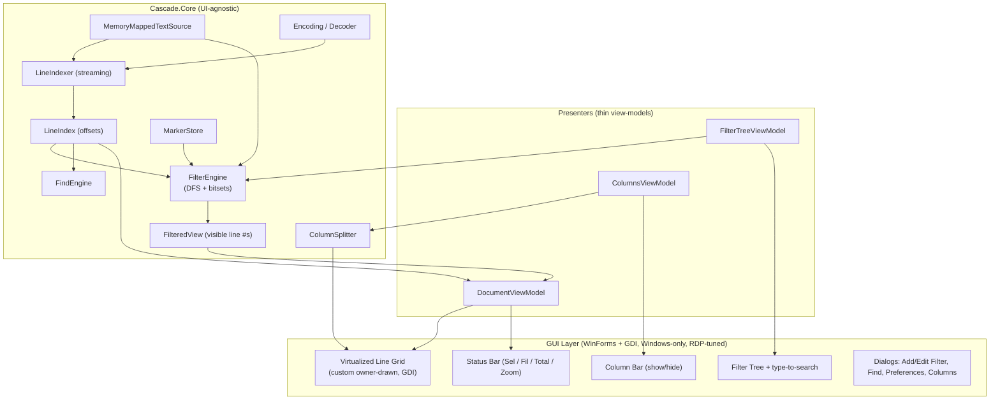
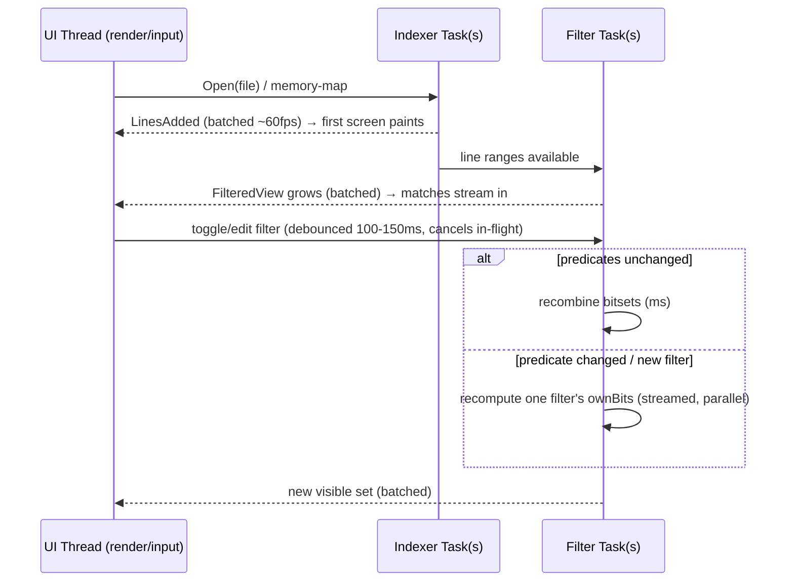

# Cascade — Design Document

**Cascade** — an enhanced,
from‑scratch reimagining of [TextAnalysisTool.NET](https://textanalysistool.github.io/).

> Status: **Plan finalized (rev. 4)** — all open questions decided (§18). Nothing is implemented
> yet; this is the agreed blueprint. Next action: build **M0** (§16, §20).
>
> **Decisions:** target **.NET 10 (LTS)**; Windows‑only **WinForms + GDI** (no GPU), tuned for Remote
> Desktop and low resource use; per‑property filter style inheritance; excludes leaf‑only; max depth
> 8; live tail out of scope; filter list uses **type‑to‑search jump/cycle**; columns via **single
> delimiter** or **`[name]` bracket template**; `.tat` **import‑only**; native format **`.cascade`**;
> product name **Cascade** everywhere. Full v1 scope in §16.

---

## 1. Purpose & Scope

TextAnalysisTool.NET (hereafter "TAT.NET" or "the original") is a Windows tool for viewing,
searching, filtering, and navigating large text/log files. Its core idea: pass every line of a
file through a set of user‑defined **filters**, then **dim or hide** lines that don't match, and
**color** lines that do. It also supports **markers** (8 bookmark types), **find**, multiple
**encodings**, saved **filter sets** (`.tat` files), and **plug‑ins** for custom file formats.

Cascade keeps 100% of that behavior as a baseline and adds five enhancements requested by the user:

1. **Instant open of extremely large files** via memory‑mapped I/O and streaming line indexing.
2. **Streaming filtering** — matching lines appear immediately while the rest of the file is still
   being evaluated.
3. **A filter‑list type‑to‑search** to quickly jump to filters to enable/disable (does **not** filter
   or hide list entries, and does **not** affect file filtering).
4. **Hierarchical (nested) filters** with precise refinement/coloring semantics (the headline new
   feature — see [§8](#8-hierarchical-filters-headline-feature)).
5. **User‑defined columns** — split each line into columns and show/hide columns, without affecting
   filtering (filters always run on the whole line).

Everything must be **as fast and responsive as possible**.

### 1.1 Goals

- Open multi‑GB files with first content visible in well under a second.
- Never block the UI thread; all indexing/filtering is background + streamed.
- Feature parity with TAT.NET, plus the five enhancements.
- Import/export legacy `.tat` filter files for interoperability.
- A UI‑agnostic **core engine** that is unit‑testable and independent of the GUI framework.

### 1.2 Non‑Goals (initial release)

- Editing the source file in place (Cascade is a viewer/analyzer, like the original).
- Full text‑editor features (syntax highlighting of arbitrary languages, code folding).
- **Cross‑platform GUI** — decided **Windows‑only**. The core engine stays portable, but the GUI
  targets Windows and is tuned for Remote Desktop; macOS/Linux is explicitly out of scope.
- Cloud/remote files (local files, clipboard, and drag‑drop first).

### 1.3 Terminology

| Term | Meaning |
|---|---|
| **Line index** | Array mapping each line number → byte offset (and length) in the file. |
| **Visible set / filtered view** | Ordered list of line numbers that currently pass the filters. |
| **Predicate** | The match test of a single filter (substring, regex, or marker). |
| **deepMatch** | A filter matches *and* all of its ancestors' predicates match (see §8). |
| **Include / Exclude filter** | Include selects lines to show; Exclude removes lines afterward. |
| **Dim mode / Filtered mode** | Show all lines (non‑matches dimmed) vs. show only matching lines. |

---

## 2. Summary of the Original Tool (parity baseline)

Captured from the official documentation, ReadMe/changelog, and screenshots so we have an explicit
parity checklist.

**Core concepts**
- **Line display**: every line shown with its original line number, marker glyphs, and color based
  on the matching filter. If a line matches multiple filters, the **topmost colored filter** wins.
  Selected lines are highlighted; non‑contiguous selection via Ctrl/Shift.
- **Filter display**: a checkbox list of filters. Enable/disable via checkbox, edit via
  double‑click/Enter, reorder via drag‑and‑drop, dockable to any side. Each enabled filter shows a
  live count `[matched / total]`. The first 26 filters map to letters A–Z for keyboard cycling.
- **Filter types**: *Matches text* (substring), *Regular expression* (.NET `Regex`), and
  *Marked by marker N*. Each filter has: text/pattern, **case sensitivity**, **regex** flag,
  **Excluding** flag, **foreground color**, **background color**, and an optional **description**.
- **Include vs Exclude**: includes isolate lines you want; excludes are applied afterward and
  remove matching lines.
- **Markers**: 8 marker types; toggle per line; navigate to next/prev of a marker; "Marked by"
  filters.
- **Find**: literal or regex, forward/back, with history shared with the filter dialog.
- **Show Only Filtered Lines** (Ctrl+H): toggle hide vs. dim of non‑matching lines.
- **Encodings**: system default, Windows‑1252, UTF‑8, UTF‑16 LE/BE, GB18030, more; BOM detection
  takes priority.
- **Filter sets**: save/load/append `.tat` (XML) files; recent files/filters lists.
- **Import sources**: open file, drag‑and‑drop file or text, paste from clipboard, `/clipboard`.
- **Copy**: selected lines to clipboard (with HTML formatting preserving colors); optional line
  numbers.
- **Preferences**: fonts, zoom, colors (including window bg/text for near‑dark‑mode), tab size,
  line‑number visibility, marker visibility (always/never/when‑in‑use), tooltip of matching
  filters, DPI/multi‑monitor scaling, filter‑column widths.
- **Plug‑ins**: `TATPlugin_*.dll` in the app folder can take over parsing a file and produce text.
- **Command line**: `InputFile /Filters:file.tat /Config:cfg.xml /Line:N /Clipboard`.

**Menus (parity checklist)**

| Menu | Items |
|---|---|
| **File** | Open, Reload, Save Current Lines, Load Filters, Save Filters, Save Filters As, Append to Existing Filters, Recent Files, Recent Filter Files, Exit |
| **Edit** | Copy, Paste, Copy Filters, Paste Filters, Select All, Find, Find Previous, Find Next, Go To, Preferences |
| **View** | Show Only Filtered Lines, Show Line Numbers, Show Filter Tool Tip, Show Markers (Always/Never/When‑In‑Use), Zoom In/Out/Reset, Filter List Location, Encoding |
| **Filters** | Previous/Next Match, Add New Filter, Edit, Remove, Enable All, Disable All, Remove All |
| **Help** | Documentation, Installed plug‑ins, About |

**Keyboard (line display)**: `Space`/`Shift+Space` next/prev matching line; `1‑8`/`Shift+1‑8` next/prev
marker; `Ctrl+1‑8` toggle marker; `A‑Z`/`Shift+A‑Z` next/prev by filter; `Ctrl+Shift+A‑Z` toggle
filter; `Ctrl+H` filtered mode; `Ctrl+F` find; zoom with `Ctrl+Wheel`.
Scrolling: `Ctrl+Up`/`Ctrl+Down` scroll a line without moving the caret; `Left`/`Right` scroll sideways
by four characters and `Home`/`End` jump to the left and right extremes, while `Ctrl+Home`/`Ctrl+End` go
to the first and last line.

**Known limitation we intend to fix**: the original *"keeps the entire data set in memory at all
times"*, so files larger than RAM cause it to struggle. Cascade's memory‑mapped design directly
targets this.

---

## 3. Technology & Framework Decision

The user explicitly asked us to choose. The decision splits into two parts: the **core engine** and
the **GUI**.

### 3.1 Core engine: **.NET 10 (C#)**

The engine (file mapping, indexing, filtering, markers, find, columns) is a **UI‑agnostic class
library** targeting **.NET 10**, the current LTS (released Nov 2025, supported ~3 years) — so we get
the newest runtime/JIT throughput and the longest support window. .NET is the right choice because
it offers everything performance‑critical we need without dropping to C++:

- `System.IO.MemoryMappedFiles` for zero‑copy access to files larger than RAM.
- `Span<T>`/`ReadOnlySpan<byte>` for allocation‑free slicing of mapped memory.
- **SIMD‑accelerated** `MemoryExtensions.IndexOf` for newline scanning and substring filters
  (multiple GB/s), plus `System.Numerics.Vector` where hand‑tuning helps.
- Compiled `System.Text.RegularExpressions.Regex` (and source‑generated regex) for regex filters.
- Excellent multithreading (`Task`, `Channel<T>`, `Parallel`) for streaming pipelines.
- Fast, safe development and a large ecosystem, matching the original's .NET heritage.

Native C++/Rust could be marginally faster in micro‑benchmarks but at a large cost in development
speed and safety; the .NET techniques above make the file‑scanning hot paths effectively
memory‑bandwidth‑bound, which is the real ceiling.

### 3.2 GUI framework options

**Decision drivers (from the reviewer):** the tool is **Windows‑only**, used **heavily over Remote
Desktop (RDP)**, and must be **simple and low‑resource**. Those three constraints — especially RDP —
change the calculus and, importantly, argue **against** GPU rendering.

**Why GPU rendering is the wrong choice here.** In a normal RDP session the physical GPU is not
exposed to applications (hardware 3D requires special server‑GPU policies you can't rely on). So
GPU‑first frameworks (Avalonia/Skia, WPF's DirectX, WinUI) **fall back to software rasterization**
inside the session and then ship the resulting **rasterized bitmaps** across the wire. RDP, by
contrast, has *native, cached* "drawing orders" for **GDI** text and rectangles: drawing a line of
text with GDI sends a compact text order (and reuses glyph/brush caches) instead of a block of
pixels. The result is dramatically **less bandwidth and lower latency** over RDP, plus lower CPU and
memory locally. GPU rendering buys us nothing in an RDP session and costs resources — exactly what we
want to avoid.

The most performance‑sensitive element is still a **virtualized, custom‑drawn text grid** (millions
of rows, per‑line colors, marker gutter, line numbers, columns). We draw it ourselves regardless of
framework; the framework just needs fast GDI text, virtualization, input, dialogs, and a simple tree
with checkboxes.

| Option | Render path over RDP | Resource use | Verdict |
|---|---|---|---|
| **WinForms** (.NET, GDI/`TextRenderer`) | **GDI drawing orders** — RDP‑native, cached, tiny on the wire | **Lowest** memory & startup; no GPU | **Recommended** |
| **WPF** (.NET) | Software render → bitmap tiles shipped by RDP | Higher memory/startup; retained visual tree | Fallback |
| **Avalonia** (Skia) | Software Skia raster → bitmaps shipped by RDP | Higher; GPU path unused over RDP | No (RDP) |
| **WinUI 3** | Composition/DirectX → software over RDP | Higher; heavier deploy | No |
| **Native C++ (Win32 + GDI/DirectWrite)** | GDI can be RDP‑friendly | Lowest | No — much slower to build; overkill |
| **Electron / web** | Full bitmap frames | Very high | No |

**Recommendation: .NET 10 core engine + WinForms GUI with a custom owner‑drawn, virtualized text
grid rendered via GDI (`TextRenderer.DrawText` / `ExtTextOut`).** This is exactly the stack the
original tool uses — proven fast and RDP‑friendly — but with our modern engine (memory‑mapped,
virtualized, streaming) behind it.

Why WinForms wins for *these* constraints:
- **RDP‑optimal**: GDI text/rect drawing maps to RDP primary drawing orders → minimal bandwidth,
  crisp text, low latency even on poor links.
- **Low‑resource**: smallest baseline memory and fastest cold start of the .NET UI stacks; no GPU,
  no compositor, no XAML engine.
- **Simple**: native `TreeView` with checkboxes for the (hierarchical) filter list, `SplitContainer`
  docking, standard dialogs — little custom UI beyond the line grid we were going to hand‑draw anyway.
- **Proven**: the original TextAnalysisTool.NET is WinForms/GDI and is well‑regarded for speed.

Modern WinForms on .NET 10 has PerMonitorV2 high‑DPI support and the current runtime's performance,
so "dated" concerns are largely addressed. Because the engine is UI‑agnostic, we could add a second
front‑end later without touching core logic — but that is explicitly not a goal.

### 3.3 Solution layout

```
Cascade.sln
 ├─ src/
 │   ├─ Cascade.Core/          # UI-agnostic engine (no GUI refs)
 │   │   ├─ IO/                #   MemoryMappedTextSource, encodings
 │   │   ├─ Indexing/          #   LineIndexer, LineIndex
 │   │   ├─ Filtering/         #   Filter model, engine, bitsets
 │   │   ├─ Columns/           #   Column specs & splitters
 │   │   ├─ Markers/           #   Marker store
 │   │   ├─ Find/              #   Find engine
 │   │   └─ Persistence/       #   .tat import, .cascade format
 │   ├─ Cascade.App/           # WinForms GUI (Windows-only) + thin presenters
 │   │   ├─ Views/             #   Forms & controls: LineGrid (custom), FilterTree, dialogs
 │   │   ├─ Presenters/        #   thin view-models (INotifyPropertyChanged + BindingSource)
 │   │   └─ Rendering/         #   GDI text grid (TextRenderer / ExtTextOut), RDP-tuned
 │   └─ Cascade.Cli/ (optional) # headless filter → file, for automation
 ├─ tests/
 │   ├─ Cascade.Core.Tests/    # xUnit unit tests
 │   └─ Cascade.Benchmarks/    # BenchmarkDotNet perf gates
 └─ docs/DESIGN.md             # this file
```

---

## 4. High‑Level Architecture



**Dataflow at a glance**

1. **Open** → memory‑map the file → `LineIndexer` scans for line starts in the background and
   streams offsets into `LineIndex`.
2. As offsets arrive, `FilterEngine` evaluates newly‑available lines and appends matches to
   `FilteredView`; the UI observes both growing collections and renders incrementally.
3. The **Line View** is virtualized: for the rows currently on screen it reads offsets from
   `LineIndex`, decodes just those bytes via the chosen `Encoding`, splits into columns if a column
   spec is active, and draws them with the color of the winning filter.
4. Toggling a filter recomputes the visible set from cached per‑filter **bitsets** (near‑instant),
   or re‑scans if predicates changed (streamed).

---

## 5. Fast File Loading (Enhancement #1)

### 5.1 Memory‑mapped source

```csharp
public sealed class MemoryMappedTextSource : IDisposable
{
    private readonly MemoryMappedFile _mmf;
    private readonly MemoryMappedViewAccessor _view;
    private readonly SafeMemoryMappedViewHandle _handle;
    private unsafe byte* _base;          // acquired pointer, whole-file view on 64-bit
    public long Length { get; }

    // Zero-copy slice of raw file bytes for [offset, offset+length)
    public unsafe ReadOnlySpan<byte> Bytes(long offset, int length)
        => new ReadOnlySpan<byte>(_base + offset, length);
}
```

- On 64‑bit we map the **whole file** as one view (virtual address space is huge; the OS pages in
  on demand). We never copy the file into managed memory.
- For pathological cases (file approaching address‑space limits, or 32‑bit), we fall back to a
  **windowed mapping** that maps fixed segments (e.g., 1 GB) and remaps as the viewport/scan moves.
- Sharing mode allows reading a file that is **actively being written** (needed for live log tailing,
  §14.3), matching the original's permissive sharing.

### 5.2 Streaming line indexer

The indexer converts raw bytes into a `LineIndex` (line number → start offset). It runs on a
background task and publishes progress in batches.

```csharp
// Encoding-aware newline scan. For ASCII/UTF-8/Win-1252, newline byte is 0x0A (with optional 0x0D).
// For UTF-16LE/BE the newline unit is 2 bytes; the scanner is parameterized by an INewlineScanner.
public interface ILineIndexer
{
    // Raised in batches (e.g., every N lines or every ~16 ms), never per line.
    event Action<LineRangeAdded> LinesAdded;   // { FromLine, ToLine, KnownComplete }
    Task RunAsync(CancellationToken ct);
}
```

Hot loop (UTF‑8/ASCII path) uses SIMD `IndexOf`:

```csharp
ReadOnlySpan<byte> span = source.Bytes(cursor, chunkLen);
int nl;
while ((nl = span.IndexOf((byte)'\n')) >= 0)   // vectorized
{
    long start = cursor + runningStart;
    index.Add(start);                          // record line start
    runningStart += nl + 1;
    span = span.Slice(nl + 1);
}
```

- **Streaming semantics**: the first batch of lines is emitted as soon as the first chunk is scanned,
  so content is on screen almost immediately, while scanning continues to EOF.
- `\r\n`, `\r`, and `\n` are all handled; trailing‑newline / no‑final‑newline handled explicitly.
- Scanning is embarrassingly parallel (split the file into chunks, scan in parallel, then stitch
  boundaries), but the **first** visible screen comes from a fast sequential scan of the head so the
  window paints instantly; parallel scan fills the rest. We present line numbers in order.

### 5.3 `LineIndex` data structure

```csharp
// Chunked to avoid Large Object Heap pressure and O(n) reallocation while growing.
public sealed class LineIndex
{
    // Each line's start offset (64-bit). Length(i) = Start(i+1) - Start(i) - newlineBytes(i).
    // Stored as a list of fixed-size long[] pages (e.g., 1<<20 entries per page).
    public long Count { get; }             // grows as indexing streams
    public long StartOffset(long line);
    public int  LengthBytes(long line);
    public bool IsComplete { get; }        // true once EOF reached
}
```

**Memory cost**: 8 bytes/line. Examples: 10M lines → 80 MB; 100M lines → 800 MB. This is the main
RAM cost and it's independent of file byte size (a 50 GB file with long lines can have few lines).
For extreme line counts we note a future optimization: **delta + varint** encoding of offsets
(most lines are short, so deltas are tiny), trading a little CPU for ~2–4× smaller index. Initial
release uses the simple `long[]` pages for clarity and speed.

### 5.4 Decoding is lazy

We **never** decode the whole file. When the Line View needs row *r*, it maps *r* → line number
via the `FilteredView`, reads that line's bytes from the mapped file, and decodes just those bytes
with the active `Encoding` into a small reusable buffer. A tiny LRU cache (a few hundred decoded
lines around the viewport) smooths scrolling. Decoding one screen (~60–100 lines) is negligible.

### 5.5 Encodings

- BOM detection first (UTF‑8/16 LE/BE), then the view's chosen encoding, then the default‑encoding
  preference, then the OS default — matching the original's precedence order.
- The `INewlineScanner` is encoding‑aware (1‑byte vs 2‑byte newline unit) so line splitting is
  correct for UTF‑16. Multi‑byte encodings like GB18030 use single‑byte `0x0A` newline detection
  (safe because `0x0A` never appears as a trailing byte of a multi‑byte GB18030 sequence).

---

## 6. Streaming Filtering (Enhancement #2)

### 6.1 What "streaming" means here

When filters change (or a file opens), matching lines must **appear immediately** at the top and
keep flowing in as evaluation proceeds down the file — the UI is never blocked and shows partial
results with a progress indicator.

### 6.2 Filtered view + incremental append

```csharp
public sealed class FilteredView
{
    // Ordered, chunked list of visible line numbers (grows as filtering streams).
    public int Count { get; }
    public long LineAt(int visibleRow);        // visibleRow -> file line number
    public int  RowForLine(long line);         // binary search (for "keep selection")
    public bool IsComplete { get; }
}
```

- The engine processes lines **in order** and appends passing line numbers, so the view is always a
  correct prefix that only grows — no reshuffling as results arrive.
- UI updates are **batched** (coalesced to ~60 fps) via a channel, so a fast match stream doesn't
  flood the dispatcher.
- Long operations are **cancellable** and **debounced**: rapid checkbox toggles cancel the in‑flight
  pass and start a new one after a short quiet period (e.g., 100–150 ms).

### 6.3 Two evaluation modes (speed/memory trade‑off)

**(A) Cached per‑filter bitsets — default when line count ≤ threshold or memory allows.**

For each filter node we cache `ownBits`: 1 bit per line, set where the filter's *own* predicate
matches. Combining filters (including the whole hierarchy and enable/disable) is then pure bitwise
math over these bitsets:

- `deepBits(F)   = AND over ancestors A of F (including F) of ownBits(A)`
- `included      = OR over enabled include F of deepBits(F)`
- `excluded      = OR over enabled exclude F of deepBits(F)`
- `visible       = included AND NOT excluded`

Because `ownBits` only depends on a filter's *predicate* (text/regex/marker + flags), **toggling
enable/disable, moving a filter, or changing colors requires no text scanning at all** — just a
bitset recombine over `visible`, which is milliseconds even for 100M lines. Only editing a
predicate (or adding a filter) recomputes that one filter's `ownBits` (streamed). This is what makes
interaction feel instant.

*Memory*: `ownBits` is N/8 bytes per filter (100M lines → ~12 MB/filter). We keep bitsets only for
filters that are enabled or on‑screen, use an LRU cache with a memory budget, and drop/recompute as
needed.

**(B) On‑the‑fly re‑scan — for extreme line counts or tight memory.**

Skip bitsets and evaluate predicates directly against mapped bytes, parallelized across chunks with
ordered output. A full pass over many GB is a few seconds and fully streamed; the first screen is
essentially instant because we process the head first.

The engine picks (A) or (B) adaptively from line count and a configurable memory budget; the mode is
visible in Preferences for power users.

### 6.4 Evaluation runs on bytes when possible

Substring (non‑regex, case‑sensitive, single‑byte encoding) filters run directly on the mapped
**bytes** with vectorized `IndexOf` — no string allocation. Case‑insensitive/regex/UTF‑16 paths
decode the line first (reusing a buffer). This keeps the common "contains this token" filter
extremely cheap.

---

## 7. Filter Quick‑Find: Type‑to‑Search (Enhancement #3)

The goal is to *get to* a filter fast so you can enable/disable it — **not** to filter the list.
Hiding non‑matching filters raises awkward questions (what about nested nodes and their ancestors?),
so Cascade instead uses **incremental type‑to‑search** over the always‑fully‑visible tree:

- **Focus the filter tree and just start typing.** A small inline find bar shows the query; the tree
  **scrolls to and selects the first filter that matches** — nothing is hidden or reordered.
- **`Enter` jumps to the next match, `Shift+Enter` the previous.** Cycling walks the tree in visible
  (depth‑first) order and **wraps** around. `F3`/`Shift+F3` do the same and are always available.
- **Matched text is bolded** in each matching filter so hits stand out as you cycle.
- **`Space` toggles enable/disable** of the selected filter — so the whole loop is keyboard‑only:
  type → `Enter`…`Enter` to land on the right one → `Space` to toggle. (Parity with the original,
  which also uses Space to toggle a filter.)
- **`Esc`** clears the query and dismisses the find bar; the current selection stays put.
- Matches against filter **name/description** and **pattern text**; case‑insensitive by default, with
  an optional case/regex toggle in the find bar.

**Interaction note (avoids a shortcut clash):** while a query is active, `Enter` = *next match*; when
there is no active query, `Enter` (and double‑click) **edits** the selected filter, preserving the
original's behavior. `Esc` ends “find mode” and restores `Enter`‑to‑edit.

The hierarchy stays fully visible and unchanged throughout, and **none of this affects the file's
filtered view** — it is purely navigation within the filter list.

---

## 8. Hierarchical Filters (Headline Feature)

### 8.1 Requirements restated (my understanding)

The original has a **flat** list: a line shows if it matches **any** enabled filter, colored by the
**topmost** matching filter. Cascade keeps that and adds nesting:

- **(a)** Every filter may have any number of **sub‑filters**, nested arbitrarily (a configurable
  **max depth**, default 8, keeps the UI and evaluation bounded).
- **(b)** A sub‑filter is a **refinement** of its parent: if a filter is **enabled**, a line matches
  it only if the line **also matches every ancestor's predicate** — *even if those ancestors are
  disabled*. Ancestors act as mandatory `AND` constraints.
- **(c)** A displayed line is colored/styled by the **deepest** enabled filter that matches it.
- **(d)** If a line matches an enabled filter but matches **none of that filter's descendants**, the
  line is **still shown**, colored by that (parent) filter.

### 8.2 Formal semantics

Let each filter node `F` have predicate `p_F` (its own match test) and an `enabled` flag. Let
`path(F)` be `F` and all its ancestors up to the root.

```
deepMatch(F, line)  ≡  AND over A in path(F) of p_A(line)
```

- **Display rule.** A line is shown ⇔ there exists an **enabled Include** filter `F` with
  `deepMatch(F, line) = true`, **and** there is **no** enabled **Exclude** filter `X` with
  `deepMatch(X, line) = true`.
- **Color rule.** Among enabled Include filters `F` with `deepMatch(F, line)`, choose the one of
  **greatest depth**; ties (equal depth, different subtrees) break by **document order** (topmost),
  mirroring the original's topmost rule. This chosen filter's **style is then resolved per property
  with inheritance** (see §8.5): each attribute (foreground, background, bold, italic, …) that the
  chosen filter does **not** set explicitly is inherited from its **nearest ancestor** (enabled or
  not) that does set it, falling back to the view default. Foreground and background inherit
  **independently**.
- **(d)** falls out naturally: an enabled parent with `deepMatch = true` qualifies even when no
  child matches, so the line shows in the parent's color.
- **(b)** is exactly the `AND over ancestors`, independent of ancestor `enabled` state.

**Boolean view.** The tree expresses a formula in disjunctive normal form: the visible set is the
**OR across enabled include leaves/nodes** of the **AND along each path**. Nesting = AND with
ancestors; siblings/subtrees = OR. This is a clean, predictable mental model.

### 8.3 Worked examples (explaining it back)

**Example 1 — refinement + coloring.** Filters (checkbox shows enabled):

```
[x] Error            (red)          p = contains "Error"
    [x] Disk         (orange)       p = contains "disk"
        [ ] Timeout  (yellow)       p = contains "timeout"
    [ ] Network      (blue)         p = contains "network"
```

| Line | Matches (own p) | deepMatch enabled? | Shown? | Color | Why |
|---|---|---|---|---|---|
| `Error: disk failure` | Error, Disk | Disk ✓ | Yes | **orange** | Deepest enabled match is Disk. |
| `Error: disk timeout` | Error, Disk, Timeout | Disk ✓ (Timeout disabled) | Yes | **orange** | Timeout matches but is disabled → deepest *enabled* is Disk. |
| `Error: network down` | Error, Network | Error ✓ (Network disabled) | Yes | **red** | Rule (d): matches Error, no enabled descendant matches → show in parent color. |
| `Warning: disk full` | Disk (own only) | none | **No** | – | Disk requires ancestor "Error" too (deepMatch fails); Error itself doesn't match. |
| `Info: all good` | none | none | No | – | Matches nothing. |

**Example 2 — disabled parent still constrains.**

```
[ ] Error            (red)          p = contains "Error"
    [x] Disk         (orange)       p = contains "disk"
```

| Line | deepMatch(Disk) = p_Error ∧ p_Disk | Shown? | Color |
|---|---|---|---|
| `Error: disk failure` | ✓ | Yes | orange |
| `Error: network` | ✗ (no "disk") | No | – |
| `Warning: disk` | ✗ (no "Error") | No | – |

Even though **Error is disabled**, its predicate still gates Disk. Disabling a parent means "don't
show the parent's own broad matches, but keep using it to scope my enabled children."

**Example 3 — exclude within a scope.**

```
[x] Error                 (red)     p = contains "Error"
    [x] (exclude) Retry             p = contains "will retry"
```

`Error: disk failure` → shown red. `Error: timeout, will retry` → matches Error but the enabled
exclude's `deepMatch` (Error ∧ "will retry") is true → **hidden**. The exclude only removes lines
**within** the Error scope, because it too must match its ancestors.

### 8.4 Evaluation algorithm (efficient tree walk)

The tree structure makes evaluation **faster** than a flat list because a non‑matching parent prunes
its entire subtree (children can't match without the parent):

```csharp
// Per line. Returns (shown, winningFilter). Excludes suppress.
(bool shown, Filter? color) Evaluate(ReadOnlySpan<char> line)
{
    int bestDepth = -1; Filter? best = null; bool excluded = false;

    void Dfs(Filter node, int depth)
    {
        if (!node.SubtreeHasEnabled) return;        // prune: nothing enabled below/at node
        if (!node.Predicate.Matches(line)) return;  // prune: descendants require this match
        if (node.Enabled)
        {
            if (node.Kind == Include) { if (depth > bestDepth) { bestDepth = depth; best = node; } }
            else                      { excluded = true; }
        }
        foreach (var c in node.Children) Dfs(c, depth + 1);
    }

    foreach (var root in roots) Dfs(root, 0);
    return (best != null && !excluded, best);
}
```

- `SubtreeHasEnabled` is precomputed on any enable/disable/structure change so we skip inert
  subtrees entirely.
- We evaluate each node's predicate **at most once per line** and short‑circuit aggressively.
- In **bitset mode** the equivalent is the AND/OR combination in §6.3; the DFS above is the reference
  semantics and the on‑the‑fly path.

### 8.5 Design decisions & edge cases

- **Max depth**: default **8** (confirmed), configurable. Bounds UI depth and worst‑case work.
- **Per‑property style inheritance (confirmed behavior).** Every style attribute is *optional* on a
  filter. When rendering a line, the winning filter's style is resolved attribute‑by‑attribute: for
  each of `foreground`, `background`, `bold`, `italic` (etc.), if the winning filter sets it
  explicitly, use it; otherwise walk **up to the nearest ancestor that sets it** — *regardless of
  whether that ancestor is enabled* — and use that; if none in the chain sets it, use the view
  default. Foreground and background (and each other attribute) resolve **independently**, so a
  filter can, e.g., inherit its parent's background while overriding only the foreground.
  - *Example.* `Error` sets fg=black, bg=pink. Child `Disk` sets **only** fg=darkorange (bg unset).
    A line colored by `Disk` renders **fg=darkorange on bg=pink** (bg inherited from `Error`). If
    `Disk` also left fg unset, it would render fully in `Error`'s black‑on‑pink.
  - The Add/Edit Filter dialog shows each color/style with an explicit **"Inherit"** state (e.g., an
    "Inherit from parent" checkbox/swatch) so unset vs. set is visible and intentional.
- **Tri‑state checkboxes**: a parent shows checked/unchecked/indeterminate reflecting descendants;
  optional "enable applies to whole subtree" convenience action.
- **Drag‑and‑drop reordering *and* nesting.** Drag one or more selected filters and drop **between**
  two rows to reorder them at that position (as siblings), or drop **onto** a row to **nest** them as
  that row's children. Distinct drop indicators show "insert here" vs. "nest inside"; a drop is
  blocked if it would exceed the max depth (8) or move a node into its own descendant. Reordering
  matters because color ties break by document order / topmost (§8.2).
- **Excludes are leaf‑only (confirmed).** An *exclude* filter cannot have children; it removes
  matching lines **within its parent's scope** (it must still satisfy its ancestors' predicates).
  This keeps semantics obvious — "inside these Error lines, hide the retries" — without the confusion
  of what a child *of* an exclude would mean.
- **Counts**: each enabled filter shows `[deepMatched / total]` computed from `visible`/bitsets.
- **Legacy `.tat`** loads as a **flat** tree (all roots), so old filter sets behave exactly as before.

### 8.6 Suggested enhancements (for your consideration)

1. **Per‑node combinator**: default children = OR; optionally mark a node's children as `AND` or add
   explicit `NOT` nodes → full boolean expressions while keeping the simple default.
2. **Solo/Focus**: temporarily view only one subtree without changing checkboxes.
3. **Filter groups / templates**: reusable, named subtrees (e.g., a "HTTP errors" pack) importable
   across sessions.
4. **Auto‑shade by depth**: derive child background as a tint/shade of the parent for instant visual
   hierarchy.
5. **"Add child from selection"**: right‑click a line → create a sub‑filter under the currently
   selected filter, pre‑filled from the line.
6. **Drag‑and‑drop reparenting** with live re‑evaluation.
7. **Match heat**: show each node's contribution so you can prune filters that never match.

---

## 9. Columns (Enhancement #5)

Split each line into columns and choose which columns to display. **Filtering always runs on the
whole raw line** — columns are purely a display/organization concern.

### 9.1 Column specification

```csharp
public sealed class ColumnSpec
{
    public ColumnSplitMode Mode;       // Delimiter | Template

    // Delimiter mode: split on a single delimiter.
    public string? Delimiter;          // e.g. "\t", ",", "|", " "
    public bool CollapseConsecutive;   // treat runs of the delimiter as one (whitespace-columned logs)
    public int? MaxSplits;             // optional cap; remainder stays in the last column

    // Template mode: a layout naming each column in [brackets]; literal text between the
    // placeholders is the separator. Example: "[time] [level] [message]".
    public string? Template;           // compiled internally to an anchored regex (see below)

    public List<ColumnDef> Columns;    // per-column: Name, Visible, Width, Alignment, order
}

public sealed class ColumnDef
{
    public string Name;                // "[name]" from the template, or "Col 1.." in delimiter mode
    public bool Visible = true;
    public double? DisplayWidth;       // px; user-resizable; auto-fit option
    public TextAlign Align;            // Left/Right/Center
    public int Order;                  // reorder display without touching parsing
}
```

Two splitting modes cover the common cases (kept deliberately simple):
- **Single delimiter** — split on one delimiter (tab, comma, pipe, space, or custom), with an
  optional *collapse consecutive* for whitespace‑columned logs and an optional max‑split cap.
- **Bracket template** — write a layout that **names each column in `[]`**, e.g.
  `[time] [level] [message]`. The literal text *between* the placeholders (here, single spaces) is
  the separator and the bracket names become the column headers. It compiles to an anchored regex
  under the hood (each `[name]` → a non‑greedy named group, the **last** one greedy), so
  `2026-07-25 INFO Starting the service` → `time=2026-07-25`, `level=INFO`,
  `message=Starting the service`.
  - **Literal brackets in the log** are handled by wrapping a placeholder in literal brackets:
    template `[[level]] [msg]` matches `[INFO] hello` → `level=INFO`, `msg=hello`. (Any character in
    the template that isn't part of a `[name]` placeholder is treated as a literal separator.)
  - A line that doesn't fit the template degrades gracefully to a single full‑width cell.

**Real example (the project's test file).** The ~1.9 GB ETW trace at `E:\Repos\test-file.txt` has
every field bracket‑delimited with no separators between them, e.g.:

    [2026-07-16T…][inventory-svc][3][2FA8][315C][util_c5024][HidpWppDumpFdo][INFO][TRACE_FLAG_PNP] FDO:0x… message

The bracket template captures it cleanly (adjacent literal brackets, empty fields allowed, greedy
final message column):

    [[time]][[provider]][[cpu]][[pid]][[tid]][[source]][[func]][[level]][[flags]] [message]

Since splitting is per‑screen only, this is instant even on the full 1.9 GB file. An **"auto‑detect
leading `[...]` groups"** button will offer to generate this template from a sample line in one click.

### 9.2 Display & behavior

- The Line View renders enabled columns as aligned cells with resizable headers; hidden columns are
  simply not drawn (their text still exists in the underlying line).
- Splitting is **lazy** — only for rows on screen — so it costs nothing for the millions of
  off‑screen lines.
- If a line doesn't match the spec (too few delimiters, template mismatch), it degrades gracefully:
  shown as a single full‑width cell (and flagged subtly), never dropped.
- **Column profiles** are saved with the workspace/`.cascade` file so a given log format reopens with
  the right layout.
- **Copy** can honor columns: copy visible columns as TSV/CSV (nice for pasting into a spreadsheet),
  while "Copy raw" always copies original lines.
- Explicit guarantee: **enabling/disabling/reordering columns never changes the filtered set or line
  numbers** — filters and find operate on the full raw line text.

### 9.3 Optional (future)

- Column‑scoped **find** and column‑scoped **filters** as an opt‑in (kept off by default to honor the
  "filters run on whole line" requirement).
- Right‑align/format numeric columns; detect and colorize a "level" column.

---

## 10. Other Parity Features

### 10.1 Markers
- 8 marker types stored in a `MarkerStore` (a small map line→bitmask, since only marked lines are
  stored). Toggle via `Ctrl+1‑8`; navigate next/prev via `1‑8`/`Shift+1‑8`; "Marked by marker N"
  filter type integrates with the filter engine (its predicate consults the `MarkerStore`).
- Marker gutter visibility: Always / Never / When‑In‑Use (persisted).

### 10.2 Find
- Literal or regex, forward/backward, from current line; wraps optionally.
- Runs against the same lazy‑decoded lines; for big jumps it scans mapped bytes directly.
- Shared history with the filter editor ("promote a find to a filter").

### 10.3 Selection, copy, clipboard
- Multi‑line and non‑contiguous selection (Ctrl/Shift), Select All.
- Copy as plain text and as **HTML preserving colors** (like the original), optional line numbers,
  and (new) copy‑as‑TSV honoring visible columns.
- Import: open file, drag‑and‑drop file/text, paste clipboard, `/Clipboard` — with the paste/replace
  confirmation the original added.

### 10.4 Preferences / theming
- Fonts + zoom (persisted; `Ctrl+Wheel`), tab size, line‑number visibility & copy inclusion, marker
  visibility, filter tooltip, window bg/text colors (near‑dark‑mode) plus a proper **dark theme**,
  DPI/multi‑monitor scaling, filter‑column widths, remember window position.
- Import/Export config XML (parity), plus the new `.cascade` workspace.

### 10.5 Command line

**Implemented today:**

```
Cascade.exe [file] [/Filters:<path>] [/demo]
```

| Argument | Behaviour |
| --- | --- |
| `file` | Any argument not starting with `/` or `--`. Opened if it exists, silently ignored if not. |
| `/Filters:<path>` | A `.cascade` or `.tat` filter file; also suppresses auto-loading the last one used. |
| `/demo` | Enables the first four filters and selects the first. Used by the screenshot harness. |

Only the **last** `file` and the **last** `/Filters:` win — neither is accumulated. With no `/Filters:`,
the last filter file is auto-loaded unless that is switched off in Preferences.

Diagnostic and internal switches. Each returns before any window is created, and each is recognised
**only as the first argument** (`Cascade.exe foo.log --version` opens the log, it does not print a version):

| Switch | Purpose |
| --- | --- |
| `--help`, `-h`, `/?` | Prints the usage above and exits. |
| `--version` | Prints the informational version and exits. Also how a downloaded update proves it runs. |
| `--selftest [file] [/Filters:x]` | Headless engine, settings and rendering checks; log in `%TEMP%\cascade_selftest.log`. Exit 0 pass, 1 fail, 2 exception. |
| `--screens [outDir] [file] [file.tat]` | Renders every dialog and the main window to PNGs for visual review. `outDir` is picked as the first argument that already exists as a directory or contains "shots", so create it first. |
| `--cleanup <pid> <path>` | Started by the previous version as it exits, to delete the executable it ran from. |

**Not implemented** (parity goals from the original, listed here so the gap is not mistaken for a bug):
`/Config:c.xml`, `/Line:N` and `/Clipboard` are not recognised, and multiple `/Filters:` arguments are
not appended.

### 10.6 Updating

Cascade updates itself from its GitHub releases. The check runs **once, at startup**, on a background
thread; there is no periodic polling.

- **Authentication.** The releases are private, so the app borrows the credential the user already gave
  to git, via `git credential fill` with all interactive prompts disabled (`GIT_TERMINAL_PROMPT=0`,
  `GCM_INTERACTIVE=never`). No token is embedded in the binary and none is stored. A machine without a
  credential simply never updates. `git.exe` is resolved to an **absolute path**, never by name, and never
  from the application's own directory: `CreateProcess` searches that directory first, and this app is
  designed to be copied into shared folders. The credential is only ever sent to `api.github.com`, so
  pointing `CASCADE_UPDATE_API` elsewhere cannot collect it. A private asset must be fetched from the API
  asset endpoint with `Accept: application/octet-stream` - the plain `browser_download_url` returns 404
  even when authenticated.
- **One updater per copy.** Every instance tries for an exclusive lock file next to the executable
  (`Cascade.update.lock`, opened `FileShare.None` with `DeleteOnClose`); whoever misses it simply does not
  update this session. A lock *file* rather than a named mutex: it is keyed to the install location by
  construction, the kernel releases it if the holder is killed, it has no thread affinity (the update path
  is `async`, and a `Mutex` cannot be released on another thread), and on a network share the server
  enforces it where a machine-scoped mutex would not stop a second machine.
- **Download.** Written to a per-process `Cascade.new.<pid>.part`, then renamed to `Cascade.new.exe` once
  verified, so a partial file never wears the trusted name.
- **Verification.** Before it is trusted, the download must be a real PE image *and* answer `--version`
  with a version and exit code 0. A file that cannot do that is deleted, never installed. The check is
  killed if it does not answer promptly, so a hung or window-opening build cannot leak a process.
- **Installation.** One call: `ReplaceFile` puts the new build at `Cascade.exe` and moves the running image
  to `Cascade.old.exe` in the same operation, so there is **never an instant with no executable**. Windows
  permits this on a running image where an overwriting `Move` fails with ACCESS_DENIED, and the process
  carries on from the moved-aside file. It happens at startup, while the app runs: that does not disturb
  the session, and unlike installing on the way out it cannot be lost to a kill, a dropped RDP session or
  a power cut later on. The new build takes effect at the next launch.
- **Versions.** The baseline is the version of `Cascade.exe` **on disk**, read from its version resource
  without running it - not the running process's version, which would re-install after every update and
  could downgrade. Comparison is on three components: the running build parses `2026.8.1` (Revision -1)
  while the same file's resource reads `2026.8.1.0` (Revision 0), and -1 &lt; 0 would make every build look
  older than itself.
- **Cleanup.** The superseded image cannot delete itself, so the exiting app starts the newly installed
  exe with `--cleanup <pid> <path>`; it waits for the old process and removes the file (measured at
  ~3 ms after exit). With several instances the image stays in use until the last one leaves, so every exit
  tries a direct delete first and only hands over to a helper for files still held. `--cleanup` refuses any
  path that is not a superseded image beside the executable. A startup sweep removes anything left behind
  by a kill or power loss, and it runs whether or not updating is enabled - but it never touches a staged
  build, which only the lock holder may judge.

Test hooks (environment variables): `CASCADE_UPDATE=off` disables updating entirely (the UI tests set
this so a run never touches the network); `CASCADE_UPDATE_FORCE=1` installs the latest release even when
it is not newer, and lets a local build update itself, so the whole path can be exercised without
publishing anything; `CASCADE_UPDATE_API` and `CASCADE_UPDATE_REPO` point the updater at a stub server;
`CASCADE_UPDATE_TOKEN` supplies a credential directly.

A locally built exe reports version `1.0.0`, which would make every release look newer than it. Such
builds never update themselves unless forced.

### 10.7 Plug‑ins (later milestone)
Keep the original's idea: a plug‑in can take responsibility for a file and produce text (e.g., decode
a binary/compressed format). Modern form: a `ITextSourcePlugin` discovered from a `plugins/` folder,
sandboxed via `AssemblyLoadContext`. Deferred past v1 but the `ITextSource` abstraction is designed
to accommodate it now.

---

## 11. Concurrency & Threading Model



Rules:
- **UI thread** only renders visible rows and handles input — never scans the file.
- Indexing and filtering run on background tasks; results are delivered via bounded `Channel<T>` and
  **coalesced** to one dispatcher update per frame.
- All long work is **cancellable**; filter changes are **debounced**; a new pass cancels the old.
- The memory‑mapped view and `LineIndex` are safe for concurrent readers (append‑only index with a
  published `Count` via `Volatile`/memory barriers; readers only touch `[0, Count)`).

---

## 12. File Formats & Persistence

### 12.1 Filter collections (save / load / append — parity)

Filters live in **collection files** you manage exactly like the original (File menu): **New**,
**Open / Load Filters…** (replaces the current set), **Save**, **Save As…**, **Append to Existing
Filters…** (merges another collection into the current one), plus a **Recent Filter Files** list. So
you can keep many different filter collections and switch between them. The native format is
**`.cascade`** (JSON), because it must store things `.tat` cannot:
- hierarchical filters (nesting, per‑node enabled, include/exclude, per‑property style, optional
  combinator),
- column specs/profiles,
- optional view state (encoding, filtered mode, zoom, marker visibility).

`schemaVersion` + additive‑only changes keep old files loadable. A "filters changed" title‑bar
indicator and a save prompt on exit mirror the original (only when a backing file exists).

### 12.2 One‑time import of a legacy `.tat` file

Cascade imports the original's `.tat` (XML) filter files via **File ▸ Import filters from .tat…** (and
`Load`/`Append Filters` also accept `.tat`). Verified against a real **175‑filter** file
(`E:\Scripts\Orders.tat`, `version="2025-11-21"`). Schema and mapping:

```xml
<TextAnalysisTool.NET version="2025-11-21" showOnlyFilteredLines="False">
  <filters>
    <filter enabled="n" excluding="n" description="" foreColor="ff0000"
            type="matches_text" case_sensitive="n" regex="n" text="[ERROR]" />
    <filter enabled="n" excluding="n" description="" foreColor="ffff00" backColor="000000"
            type="matches_text" case_sensitive="n" regex="y" text="\[OrderService\].+Svc::" />
  </filters>
</TextAnalysisTool.NET>
```

| `.tat` attribute | Cascade model | Notes |
|---|---|---|
| `text` | `match.text` | XML‑unescaped (`&quot;`→`"`, `&amp;`→`&`, `&lt;`/`&gt;`). Brackets are literal in substring mode. |
| `type="matches_text"` | `match.type = text` | Substring. Marker types (if present in other files) → marker predicates. |
| `regex="y"/"n"` | `match.regex` | .NET `Regex` syntax — already compatible. |
| `case_sensitive="y"/"n"` | `match.caseSensitive` | — |
| `excluding="y"/"n"` | `kind = exclude / include` | — |
| `enabled="y"/"n"` | `enabled` | — |
| `description` | `name` / `description` | Empty → derive a display name from `text`. |
| `foreColor` (6‑hex RGB) | `style.fg` | **Absent → unset** (view default) — matches per‑property inheritance (§8.5). |
| `backColor` (6‑hex RGB) | `style.bg` | **Absent → unset**. |
| legacy `color` attr | `style.fg` | Accepted for pre‑2014 files (back‑compat). |
| root `showOnlyFilteredLines` | view "filtered mode" | Applied on import. |

Import brings the flat list in as **top‑level filters** (roots); you then nest/organize as you wish,
preserving each filter's `enabled`/`excluding` state. **v1 is import‑only** — the native save format
is `.cascade`. (`.tat` *export*, which would be lossy since `.tat` has no hierarchy/columns/bold, is
deferred; if added later it will warn before flattening.)

Sketch:

```jsonc
{
  "schemaVersion": 1,
  "filters": [
    // Any style attribute may be omitted => inherit from nearest ancestor that sets it, else default.
    { "id": "…", "name": "Error", "kind": "include", "enabled": true,
      "match": { "type": "text", "text": "Error", "caseSensitive": false, "regex": false },
      "style": { "fg": "#000000", "bg": "#F8D7DA" },
      "children": [
        { "name": "Disk", "kind": "include", "enabled": true,
          "match": { "type": "text", "text": "disk", "caseSensitive": false },
          "style": { "fg": "#B34700" },          // bg omitted => inherits "#F8D7DA" from Error
          "children": [] }
      ] }
  ],
  "columns": { "mode": "template",
    "template": "[time] [level] [message]",
    "columns": [ { "name": "time", "visible": true }, { "name": "level", "visible": true },
                 { "name": "message", "visible": true } ] }
}
```

---

## 13. Rendering Pipeline (Virtualized Line Grid)

- A single custom `Control` overrides `OnPaint` and draws with **GDI** via `TextRenderer.DrawText`
  (or P/Invoke `ExtTextOut` on the hot path). **No stock list control** for the main view.
- Given scroll offset + viewport height and the fixed line height, compute `firstRow..lastRow`
  (~60–100 rows). For each: `line = FilteredView.LineAt(row)`, read bytes, decode (LRU‑cached),
  split columns if active, draw: marker gutter → line number → column cells with the winning
  filter's resolved fg/bg (§8.5) (or dimmed if in dim mode and not matching).
- **GDI text with opaque background** (`ETO_OPAQUE`) paints text+background in one call, minimizing
  flicker without a full offscreen buffer; horizontal scroll for long lines; **very long lines
  truncated for display** with a "[…display truncated…]" note (filter/find/copy still use full
  text), mirroring the original's safeguard.

**RDP‑tuned rendering (key for this project):**
- **Draw with GDI orders, not bitmaps.** Prefer direct `TextRenderer`/`ExtTextOut` over blitting a
  large offscreen bitmap so RDP transmits compact, cacheable text/rect orders instead of pixels.
- **Invalidate minimally.** Repaint only the rows/regions that actually changed (scroll delta,
  selection change, a row whose color changed) — never the whole client area — so the on‑the‑wire
  delta stays tiny.
- **No idle animation.** No blinking, gradients, alpha‑blending, or timer‑driven repaints; solid
  colors only. These are cheap locally but expensive as RDP bitmap updates.
- **"Remote session" auto‑profile.** Detect `SystemInformation.TerminalServerSession` and default to
  the leanest settings (grayscale/no sub‑pixel AA, no double‑buffer blits, reduced smooth‑scroll); a
  manual toggle lives in Preferences.
- Scrollbar reflects `FilteredView.Count` (which grows during streaming); thumb dragging maps
  directly to rows.
- **Dim vs Filtered** are just two row sources over the same data: dim mode iterates all file lines
  and greys non‑matches; filtered mode iterates only `FilteredView`. Switching preserves the current
  line where possible (via `RowForLine`).

**Performance targets** (acceptance gates, measured by BenchmarkDotNet + manual on a 5–10 GB log):
- First screen visible **< 300 ms**; full index of 10 GB streamed in the background.
- Enable/disable a filter reflected in **< 50 ms** (bitset mode).
- Scroll sustained at **60 fps**; memory ≈ index (8 B/line) + bitsets budget + small caches, **not**
  the file size.

---

## 14. Selected Enhancements Beyond the Requirements

These are optional but high‑value for a log/analysis tool; flagged for prioritization.

1. **Timestamp awareness** — detect a time column; filter by time range; show delta between adjacent
   selected lines; (later) merge multiple files by timestamp.
2. **Minimap / density strip** — a thin overview showing where matches/markers cluster. *(Kept
   static and redrawn only on change to stay RDP‑friendly.)*
3. **Regex editor niceties** — live match count + inline preview + syntax validation in the filter
   dialog (the original already validates in real time; we add a live sample preview).
4. **Session/workspace save** — reopen a file with the same filters, columns, markers, and scroll.
5. **Dark theme** (solid colors, RDP‑friendly) and high‑DPI (PerMonitorV2) polish.
6. **Headless CLI** (`Cascade.Cli`) to apply a `.cascade`/`.tat` to a file and emit the filtered result —
   great for scripts/CI.
7. **Detail / inspector pane** — for very long lines (e.g., the trace's 1 KB+ JSON payloads), a
   toggleable pane that word‑wraps and JSON‑pretty‑prints the selected line.

*(Live tail / follow was considered and is **out of scope** per the reviewer.)*

---

## 15. Testing & Quality

**Real fixtures (provided).**
- **`E:\Repos\test-file.txt`** — a **~1.9 GB** real ETW/WPA Orders trace (bracket‑delimited
  fields, long JSON lines). Primary large‑file fixture for load/stream/scroll/filter/columns
  benchmarks and manual RDP testing. Validates: first screen < 300 ms, streaming index to EOF,
  bracket‑template columns, and filtering under the §13 targets. *(Not committed to the repo;
  referenced via a test‑settings path/env var so CI can substitute a generated file.)*
- **`E:\Scripts\Orders.tat`** — a real **175‑filter** legacy file; the canonical `.tat` **import**
  test (mapping in §12.2), covering regex filters, an `excluding` filter, and missing‑color (unset)
  cases. Applying it to `test-file.txt` is an end‑to‑end scenario test.

**Automated tests.**
- **Engine unit tests (xUnit)**: line indexing across `\n`/`\r\n`/`\r`, no‑final‑newline, empty
  file, huge synthetic files; encoding/BOM cases; filter predicate correctness; **hierarchical
  semantics** with the §8.3 examples as golden tests; bitset‑mode vs on‑the‑fly mode must produce
  identical visible sets (differential test); both column split modes (delimiter + bracket template,
  incl. adjacent/empty/literal‑bracket cases); `.tat` import mapping + `.cascade` round‑trip.
- **Property‑based tests** for the equivalence "bitset combine ≡ DFS reference" over random filter
  trees and random lines.
- **Benchmarks (BenchmarkDotNet)** gating the §13 targets, run against `test-file.txt` plus
  on‑the‑fly generated files of various shapes (few huge lines vs. many tiny lines).
- **UI smoke tests** via UI Automation (WinForms/UIA) for open→filter→copy and the type‑to‑search
  flow.

---

## 16. Scope & Phased Delivery Plan

**v1 (initial release) = M0–M5.** Post‑v1 differentiators = M6+.

**In v1 (committed):**
- Fast open of huge files: memory‑mapped source, streaming line index, lazy decode, virtualized GDI
  grid; horizontal scroll; long‑line display truncation.
- Encodings (BOM + System/UTF‑8/UTF‑16 LE‑BE/Windows‑1252), line numbers, zoom, status bar.
- Selection (multi/non‑contiguous), Select All, copy (plain + color HTML + TSV‑by‑columns), find
  (literal/regex, next/prev), go‑to‑line.
- Filters: include/exclude, substring/regex/marker, fg/bg + bold/italic, enable/disable, live counts,
  dim vs. filtered mode; **streaming** evaluation with adaptive bitsets.
- **Hierarchical filters** (full §8 semantics, per‑property style inheritance, tri‑state, max depth 8,
  excludes leaf‑only) with add‑child‑from‑line and **drag‑drop reordering & nesting** (§8.5).
- **Filter type‑to‑search** (jump/cycle, bold matches, `Space` toggles).
- **Columns**: single delimiter + `[name]` bracket template, auto‑detect leading `[...]` groups,
  show/hide/reorder/resize (lazy, per‑screen).
- Markers (8 types: toggle + navigate).
- Filter **collections**: New/Open/Save/Save As/Append + Recent (native **`.cascade`**); **one‑time
  `.tat` import** (flat → roots).
- Preferences (fonts, colors, tab size, marker/line‑number visibility, remember window, **dark
  theme**, PerMonitorV2 DPI) + **RDP lean auto‑profile**; menu/keyboard parity; command line
  (`InputFile /Filters /Line /Clipboard`).

**Deferred (post‑v1):** detail/inspector pane (JSON pretty‑print — fast‑follow), timestamp tools,
minimap, headless CLI, plug‑in host, auto‑group imported filters into a hierarchy, per‑node AND/NOT
combinators, auto‑shade by depth, auto‑apply format profiles on open, `.tat` **export**, multi‑file
merge.

| Milestone | Contents | Proves |
|---|---|---|
| **M0 — Spike** | Memory‑mapped source + streaming indexer + minimal virtualized **WinForms/GDI** grid; open a 10 GB file locally **and** over an RDP session. | Perf ceiling + RDP responsiveness. |
| **M1 — Core viewer** | Encodings, line numbers, selection/copy, find, zoom, status bar. | Parity viewing. |
| **M2 — Flat filters** | Filter model, include/exclude, substring/regex/marker, colors, streaming filter, bitset engine, dim/filtered modes, filter collections (save/load/append, `.cascade`), one‑time `.tat` import. | Original parity. |
| **M3 — Hierarchical filters** | Nesting, deepMatch semantics, coloring, tri‑state, DFS + bitset combine, counts, `.cascade` format. | Enhancement #4. |
| **M4 — Filter quick‑find + Columns** | Type‑to‑search jump/cycle in the filter tree (bold matches, Space toggles); column split (single delimiter + `[name]` template), show/hide/reorder, profiles, copy‑as‑TSV. | Enhancements #3 & #5. |
| **M5 — Markers, preferences, polish** | Markers/navigation, full preferences, dark theme, DPI, recent lists, drag‑drop. | Full parity + UX. |
| **M6 — Extras** | Minimap, timestamp tools, CLI, plug‑in host. | Differentiators. |

---

## 17. Risks & Mitigations

| Risk | Mitigation |
|---|---|
| Bitset memory blows up for 100M+ lines × many filters | Adaptive mode (A/B), LRU + memory budget, keep bitsets only for enabled/on‑screen filters; delta‑varint index later. |
| WinForms custom grid: flicker / high‑DPI / RDP bandwidth | GDI opaque‑text draw, minimal region invalidation, PerMonitorV2, and a "remote session" lean profile (§13). |
| Encoding‑correct line splitting (UTF‑16, GB18030) | Encoding‑aware `INewlineScanner`; extensive tests; BOM precedence. |
| Very long lines / GDI text limits | Display‑truncate with full‑text preserved for filter/find/copy (as original does). |
| Hierarchical semantics misunderstood | This doc's §8 examples are the spec and become golden tests; confirm with reviewer before coding. |
| Streaming UI flooding the dispatcher | Bounded channels + per‑frame coalescing + debounced filter changes. |

---

## 18. Final Decisions (locked)

- **Runtime** → **.NET 10 (LTS)** for engine and app (§3.1).
- **GUI** → **WinForms + GDI**, **Windows‑only**, **no GPU**, RDP‑tuned, low‑resource (§3.2, §13).
- **Color** → deepest‑then‑topmost picks the *winning* filter; style resolves with **per‑property
  inheritance** (fg/bg/etc. independent; nearest ancestor that sets it, enabled or not; else
  default) (§8.5).
- **Max nesting depth** → **8**. **Excludes** → **leaf‑only** (§8.5).
- **Filter list search** → **type‑to‑search jump & cycle** (bold matches, `Space` toggles), not list
  filtering (§7).
- **Columns** → **single delimiter** or **`[name]` bracket template** (+ auto‑detect); filtering
  always on the whole raw line (§9).
- **Filter files** → native **`.cascade`** with New/Open/Save/Save As/Append + Recent; **`.tat`
  import‑only** in v1 (export deferred) (§12).
- **`.tat` import behavior** → preserve each filter's `enabled`/`excluding` as‑is; bring in **flat as
  top‑level roots**; absent colors = unset. (Auto‑grouping into a hierarchy is a post‑v1 helper.)
- **Hierarchy extras** → **in v1:** drag‑drop **reordering & nesting** + add‑child‑from‑line.
  **Deferred:** per‑node AND/NOT combinators, auto‑shade by depth.
- **Name** → **Cascade** everywhere: solution `Cascade.sln`, `Cascade.*` namespaces, native file
  extension **`.cascade`**. (Repo **folder** stays `RATAT` for now — will be renamed later.)
- **Live tail / follow** → **out of scope**.

---

## 19. Appendix — Parity Checklist (condensed)

Open/Reload/Save‑lines · Load/Save/Append filters · Recent files/filters · Copy/Paste (+HTML) ·
Copy/Paste filters · Select All · Find/Prev/Next · Go To · Preferences (fonts, zoom, colors, tab,
line numbers, marker visibility, tooltip, DPI, filter column widths) · Show Only Filtered Lines ·
Show Line Numbers · Show Filter Tooltip · Show Markers (Always/Never/When‑in‑use) · Zoom In/Out/Reset ·
Filter list docking · Encodings (System/1252/UTF‑8/UTF‑16LE/BE/GB18030/more, BOM) · Filters menu
(Prev/Next match, Add/Edit/Remove, Enable/Disable/Remove all) · Markers 1‑8 (toggle/navigate) ·
A‑Z filter cycling · Status bar (Source, Sel, Fil, Total, Zoom, funnel) · Drag‑drop import ·
`/Filters //Config /Line /Clipboard` · `.tat` XML · Plug‑ins.

**New in Cascade**: memory‑mapped streaming load · streaming filter with bitsets · filter‑tree
type‑to‑search (jump/cycle) · hierarchical filters (with per‑property style inheritance) · user
columns (single delimiter or `[name]` template) · Windows/RDP‑tuned GDI rendering · (proposed) dark
theme, CLI, minimap, timestamp tools, `.cascade` workspace.

---

## 20. Immediate Next Steps (what happens right now)

On approval I'll start **M0 — the performance spike** (prove the riskiest thing first):

1. **Scaffold the solution** (`.NET 10`): `Cascade.sln` with `Cascade.Core` (engine), `Cascade.App`
   (WinForms), `Cascade.Core.Tests` (xUnit), `Cascade.Benchmarks` (BenchmarkDotNet); `.editorconfig`,
   nullable enabled, warnings‑as‑errors, `.gitignore`.
2. **Engine core**: `MemoryMappedTextSource` + streaming `LineIndexer` (SIMD `\n` scan, chunked
   `LineIndex`, `\r\n`/`\r`/no‑final‑newline handling) with batched progress events; encoding/BOM
   detection.
3. **Minimal virtualized GDI grid** in `Cascade.App`: open a file, stream line counts in, draw only
   visible rows via `TextRenderer`, line‑number gutter, vertical + horizontal scroll, zoom.
4. **Prove it on the real fixture**: open `E:\Repos\test-file.txt` (~1.9 GB) — first screen
   **< 300 ms**, smooth 60 fps scroll, flat memory — measured **locally and over RDP**.
5. **Tests + a benchmark** for the indexer, plus a short note on the measured numbers.

**M0 exit criteria:** the 1.9 GB file opens instantly, scrolls smoothly (including over RDP), and the
indexer is covered by tests/benchmarks. Then M1→M5 proceed per §16 to reach v1.
